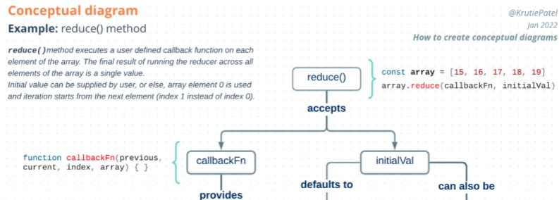

## Good Reads
- 2022-03-06 [The Painfully Shy Developer's Guide to Networking for a Better Job Without Being Creepy](https://www.samjulien.com/shy-dev-networking)
> Look, I get it. A bunch of web developers, recruiters, and vendors standing around in a room eating pizza or drinking beer and making small talk might sound like complete and utter death for you. There may be a million things you'd rather be doing. "Uhh,
    - Core Philosophy 1: Make Other People Feel Welcome and Accepted
    - Core Philosophy 2: Give First, then Give Some More
    - Core Philosophy 3: Don't Overthink - Be Genuine & Have Fun
    - Tactic 1: Smile and Say Hi
    - Tactic 2: Ask Questions (How to Approach a Group)
    - Tactic 3: Give Genuine Gratitude
    - Tactic 4: Find Common Ground
    - Tactic 5: End Gracefully
    - Tactic 6: Follow Up (No one does this!)
- 2022-03-06 [How to create technical conceptual diagrams](https://krutiepatel.com/blog/how-to-create-technical-conceptual-diagrams?utm_source=programmingdigest&utm_medium=email&utm_campaign=462)
> Conceptual diagrams have two key building blocks: concepts and connecting lines with words.

- 2022-03-09 [Bugs in Hello World · sunfishcode's blog](https://blog.sunfishcode.online/bugs-in-hello-world/)
> Hello World might be the most frequently written computer program. For decades, it's been the first program many people write, when getting started in a new programming language.
>
>Surely, this humble starting-point program should be bug free, right?

## Fun
- 2022-03-06 [UserFriendly Comic](http://ars.userfriendly.org/)
> Host is down at the moment [web.archive.org: UserFriendly Strip Comments](https://web.archive.org/web/20220228205859/http://ars.userfriendly.org/cartoons/?id=20220226)

## Work
- 2022-03-11 [jwasham/coding-interview-university: A complete computer science study plan to become a software engineer.](https://github.com/jwasham/coding-interview-university)
> I originally created this as a short to-do list of study topics for becoming a software engineer, but it grew to the large list you see today. After going through this study plan, I got hired as a Software Development Engineer at Amazon! You probably won'; 230,000 ⭐s on Github ;)


## Design Patterns
- 2022-03-06 [Modelling workflows with Finite State Machines in .NET - Lloyd Atkinson](https://www.lloydatkinson.net/posts/2022/modelling-workflows-with-finite-state-machines-in-dotnet/)
> How to implement complex logic as a FSA

## Projects
- 2022-03-07 [TomWright/dasel: Select, put and delete data from JSON, TOML, YAML, XML and CSV files with a single tool. Supports conversion between formats and can be used as a Go package.](https://github.com/TomWright/dasel)
> Comparable to jq / yq, but supports JSON, YAML, TOML, XML and CSV with zero runtime dependencies.
- 2022-03-07 [clibs/clib: C package manager-ish](https://github.com/clibs/clib)
> Package manager for the C programming language.
- 2022-03-07 [kaissaroj/chrome-newtab: A simple new tab page replacement for Google Chrome.](https://github.com/kaissaroj/chrome-newtab)
> A simple new tab page replacement for Google Chrome.
- 2022-03-10 [public-apis/public-apis: A collective list of free APIs](https://github.com/public-apis/public-apis)
> A collective list of free APIs for use in software and web development

## JavaScript
- 2022-03-09 [HTML comments work in JavaScript too](https://smitop.com/post/js-html-comments/)
> Here’s some obscure trivia about JavaScript: you can use HTML comments in JavaScript. Not just in script tags: you can use them in included standalone files, and even in Node.js and Deno. Syntax highlighters, on the other hand, do not have great support
```js
// below statement logs 1
console.log(1); <!-- log 1 -->
<!-- above statement logs 1 -->
```
- 2022-03-09 [QuickJS Javascript Engine](https://bellard.org/quickjs/)
> QuickJS is a small and embeddable Javascript engine. It supports the ES2020 specification including modules, asynchronous generators, proxies and BigInt.

## .NET/ C#
- 2022-03-06 [Image Style Transfer With C#, ONNX, and ImageSharp Khalid Abuhakmeh](https://khalidabuhakmeh.com/image-style-transfer-with-csharp-onnx-and-imagesharp?utm_source=csharpdigest&utm_medium=email&utm_campaign=405)
> Image processing with SixLabors.ImageSharp and ONNX.FastNeuralStyleTransfer

- 2022-03-10 [8 Techniques to Avoid GC Pressure and Improve Performance in C# .NET - Michael's Coding Spot](https://michaelscodingspot.com/avoid-gc-pressure/)
> .NET provides a lot of great collections types like `List<T>`, `Dictionary<T>`, and `HashSet<T>`. All those collections have dynamic size capacity. That means they automatically expand in size as you add more items.
- Set initial capacity for dynamic collections
- Use ArrayPool for short-lived large arrays
- Use Structs instead of Classes (sometimes)
- Avoid Finalizers
- Use StackAlloc for short-lived array allocations
- Use StringBuilder, but not always
- Use String Interning in very specific cases
- Avoid memory leaks
- Summary:
    - Allocations should be avoided if possible.
    - Reusing memory is better than allocating new memory.
    - Allocating on the Stack is faster than allocating on the Heap.

## Authorization & Authentication
- 2022-03-06 [Advanced techniques around ASP.NET Core Users and their claims – The Reformed Programmer](https://www.thereformedprogrammer.net/advanced-techniques-around-asp-net-core-users-and-their-claims/?utm_source=csharpdigest&utm_medium=email&utm_campaign=405)
> This article describes some advanced techniques around adding or updating claims of users when building ASP.NET Core applications. These advanced techniques are listed below with examples taken from the AuthPermissions.AspNetCore library / repo.
- 2022-03-10 [The Modern Guide to OAuth - FusionAuth](https://fusionauth.io/learn/expert-advice/oauth/modern-guide-to-oauth)
> I know what you are thinking, is this really another guide to OAuth 2.0?
> Well, yes and no. This guide is different than most of the others out there because it covers all of the ways that we actually use OAuth. It also covers all of the details you need to be an OAuth expert without reading all the specifications or writing your own OAuth server. This document is based on hundreds of conversations and client implementations as well as our experience building FusionAuth, an OAuth server which has been downloaded over a million times.

## Video Editing/ GoPro / ffmpeg
- 2022-03-11 [mifi/lossless-cut: The swiss army knife of lossless video/audio editing](https://github.com/mifi/lossless-cut)
> LosslessCut aims to be the ultimate cross platform FFmpeg GUI for extremely fast and lossless operations on video, audio, subtitle and other related media files. The main feature is lossless trimming and cutting of video and audio files, which is great for saving space by rough-cutting your large video files taken from a video camera.

