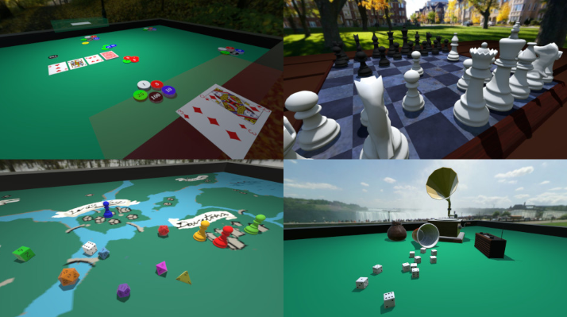
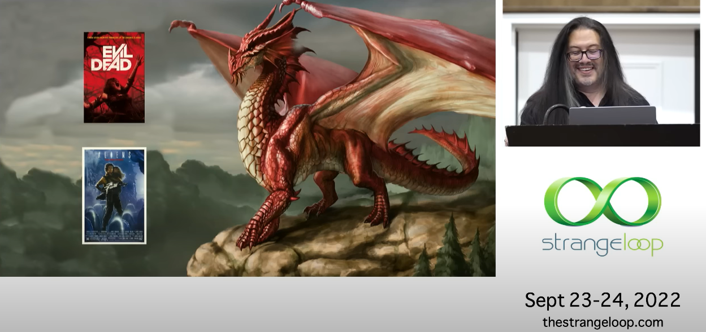

---
layout: post
title:  "Links from my inbox 2022-12-03"
date:   2022-12-03T22:43:00-08:00
categories: links
---

## Good reads

- 2022-12-03 [Don't End The Week With Nothing](https://training.kalzumeus.com/newsletters/archive/do-not-end-the-week-with-nothing)

  > Prefer Working On Things You Can Show
  >
  > One of the reasons developers have embraced OSS so much is because it gives you portable capital between companies: if your work is sitting on Github, even if you leave one job, you can take it with you to your next job. Previously this happened pretty widely but generally under the table. (Is there any programmer who does not have a snippets folder or their own private library for scratching that one particular itch?) One of the great wrinkles that OSS throws into this is that OSS is public by default, and that's game changing.

- 2022-11-29 [Post 43: Intentionally Making Close Friends — Neel Nanda](https://www.neelnanda.io/blog/43-making-friends)

  > One of the greatest sources of joy in my life are my close friends. People who bring excitement and novelty into my life. Who expose me to new experiences, and ways of seeing the world. Who help me learn, point out my blind spots, and correct me when I am wrong. Who I can lean on when I need support, and who lean on me in turn. Friends who help me grow more into the kind of person I want to be.

- 2022-11-28 [Engineers' billing nightmares · getlago/lago Wiki](https://github.com/getlago/lago/wiki/Engineers%27-billing-nightmares)

  > Our team at Lago still has some painful memories of [Qonto](https://qonto.com/)'s internal billing system, that we had to build and maintain. Why was it so painful? In this article, I will provide a high-level view of the technical challenges we faced while implementing hybrid pricing (based on subscription and usage) and what we learned during this journey.

- 2022-11-28 [FFmpeg - Ultimate Guide IMG.LY Blog](https://img.ly/blog/ultimate-guide-to-ffmpeg/)

  > In this guide, we'll go through the hot topics of FFmpeg. But before that, we'll cover some base ground to help you understand basic media concepts and FFmpeg. Feel free to skip the parts that are already trivial for you!


- 2022-11-27 [40 Useful Concepts You Should Know - by Gurwinder](https://gurwinder.substack.com/p/40-useful-concepts-you-should-know)

  > [Baader-Meinhof Phenomenon](https://lighthouse.mq.edu.au/article/july-2020/What-is-the-Baader-Meinhof-Phenomenon):
  >
  > When we notice something new, like an unusual word, we start seeing it more often. It feels like it's become more common but really we're just more alert to it, and we confuse our attention with reality itself. Hence conspiracy theories.
  >
  >
  > [Ostrich Effect](https://www.psychologytoday.com/gb/blog/loaded/201904/the-ostrich-effect):
  >
  > We often try to avoid info that we fear will cause us stress. Thus bills and work emails remain unopened, bank balances remain unchecked. This is counterproductive because ignoring a problem doesn't eliminate the problem or your anxiety; it only prolongs them.
  > 
  >
  > [Nobel Disease](https://skepticalinquirer.org/2020/05/the-nobel-disease-when-intelligence-fails-to-protect-against-irrationality/):
  >
  > We idolize those who excel in a particular field, inflating their egos and afflicting them with the hubris to opine on matters they know little about. By celebrating people for their intelligence, we make them stupid.

## Games

- 2022-11-28 [drwhut/tabletop-club: An open-source platform for playing tabletop games in a physics-based 3D environment for Windows, macOS, and Linux! Made with the Godot Engine.](https://github.com/drwhut/tabletop-club)

  > 
  >
  > Tabletop Club is an open-source multiplayer game that allows you to play your favourite tabletop games in a physics-driven 3D environment with the use of easy-to-make asset packs!
  >
  > The game is available on Windows, macOS, and Linux, and is being developed with the Godot Engine.

## Retro

- 2022-11-29 [Obsolete Sounds](https://citiesandmemory.com/obsolete-sounds/)

  > Obsolete Sounds is the world’s biggest collection of disappearing sounds and sounds that have become extinct – remixed and reimagined to create a brand new form of listening.

## Tools

- 2022-12-02 [Drag and drop from terminal](https://blog.meain.io/2022/terminal-drag-and-drop/)

  > So far, whenever I wanted to share a file from the terminal I would open up a GUI file browser, navigate to that directory, find the file and then drag and drop it. Not anymore. I recently was able to cobble together a pretty good(IMO) for dragging and dropping files to GUI applications and thought I would share.
  > Now let us see how to get this workflow. The main tool that is helping with this is [dragon](https://github.com/mwh/dragon). Here is how you use it

- 2022-11-29 [FFMPEG.WASM](https://ffmpegwasm.netlify.app/)

  > ffmpeg.wasm is a pure WebAssembly / JavaScript port of FFmpeg. It enables video & audio record, convert and stream right inside browsers.

- 2022-11-29 [What working with Tailwind CSS every day for 2 years looks like — Mosaad](https://www.themosaad.com/blog/two-years-of-tailwind-css)

  > For more than two years, I've been using Tailwind CSS almost every working day for company projects and a lot of weekends for my side projects.
  >
  > During this time, I've worked with it on projects using WordPress, Laravel, Vue.js, Next.js, Remix.run, and many other technologies.

## Security

- 2022-11-28 [Downloading the official binaries — Tabletop Club master documentation](https://tabletop-club.readthedocs.io/en/latest/general/download/downloading_binaries.html)

```sh
# Windows
certutil -hashfile TabletopClub_vX.X.X_Windows_64.zip SHA512

# macOS
shasum -a 512 TabletopClub_vX.X.X_OSX_Universal.zip

# Linux / *BSD
sha512sum TabletopClub_vX.X.X_Linux_64.zip
```

## C 

- 2022-11-28 [Everything I wish I knew when learning C - Tom M](https://tmewett.com/c-tips/)

> Learning C was quite difficult for me. The basics of the language itself weren’t so bad, but “programming in C” requires a lot of other kinds of knowledge which aren’t as easy to pick up on:
>
> - C has no environment which smooths out platform or OS differences; you need to know about your platform too
> - there are many C compiler options and build tools, making even running a simple program involve lots of decisions
> - there are important concepts related to CPUs, OSes, compiled code in general
> - it’s used in such varied ways that there’s far less a centralised “community” or style than other languages

## Seattle

- 2022-12-03 [Seattle Metro Bus Hiking](https://sites.google.com/site/seattlemetrobushiking/main-page)

  > Walks, Hikes, and Outdoor Adventures in the Seattle area that you can reach by Public Transit
  >
  > 


## Watch Me

\- 2022-12-01 ["The Early Days of id Software: Programming Principles" by John Romero Strange Loop 2022 - YouTube](https://www.youtube.com/watch?v=IzqdZAYcwfY)

> 
>
> - [id Software programming principles by John Romero](https://tomlutzenberger.github.io/id-software-programming-principles/)
>
>   > No prototypes. Just make the game. Polish as you go. Don't depend on polish happening later. Always maintain constantly shippable code.
>
>   > It's incredibly important that your game can always be run by your team. Bulletproof your engine by providing defaults upon load failure.
>
>   > Keep your code absolutely simple. Keep looking at your functions and figure out how you can simplify further.
>
>   > Great tools help make great games. Spend as much time on tools as possible.
>
>   > We are our own best testing team and should never allow anyone else to experience bugs or see the game crash. Don't waste others' time. Test thoroughly before checking in your code.
>
>   > As soon as you see a bug, you fix it. Do not continue on. If you don't fix your bugs your new code will be built on a buggy codebase and ensure an unstable foundation.
>
>   > Write your code for this game only - not for a future game. You're going to be writing new code later because you'll be smarter.
>
>   > Encapsulate functionality to ensure design consistency. This minimizes mistakes and saves design time.
>
>   > Try to code transparently. Tell your lead and peers exactly how you are going to solve your current task and get feedback and advice. Do not treat game programming like each coder is a black box. The project could go off the rails and cause delays.
>
>   > Programming is a creative art form based in logic. Every programmer is different and will code differently. It's the output that matters.
