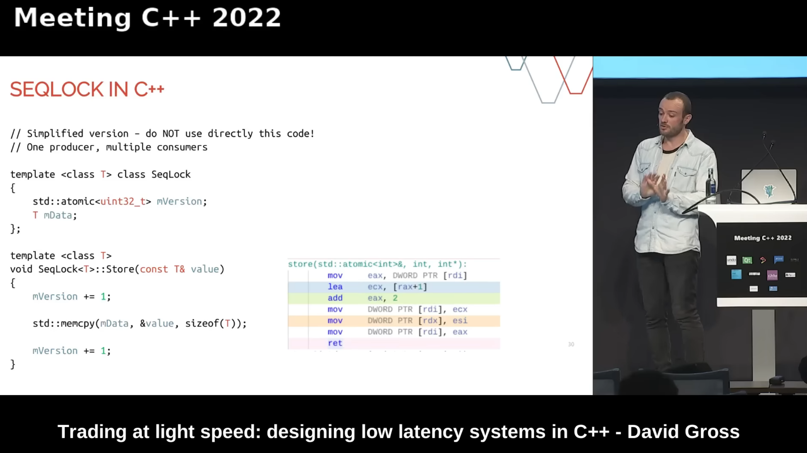

## Good reads

2023-01-29 [Davide's Code and Architecture Notes - Server-side caching strategies: how do they work? - Code4IT](https://www.code4it.dev/architecture-notes/caching-strategies)

> - Cache-aside: cache and DB do NOT interact
> - Read-through: the cache knows how to query the DB
> - Write-through: the cache can write on the DB SYNCHRONOUSLY
> - Write-behind: the cache can write on the DB ASYNCHRONOUSLY
> - Further readings: 
>
>   This whole article exists thanks to another interesting blog post I recently read and decided to extend a bit:
>
>   🔗 [Caching Strategies In Practice | Rajeev](https://medium.com/@raj.k9732/caching-strategies-in-practice-6dd141ef2e6)
>
>   Both AWS and Azure provide a way to use caching on their systems.
>
>   AWS's caching functionality is called ElastiCache. They have published a nice guide of best practices for using distributed cache:
>
>   🔗 [Caching Best Practices| AWS](https://aws.amazon.com/caching/best-practices/)
>
>   Similarly, Azure gives you a Redis instance. And they have also published their set of best practices:
>
>   🔗 [Caching guidance | Microsoft Docs](https://learn.microsoft.com/en-us/azure/architecture/best-practices/caching)
>
>   Then, Alachisoft, the creators of NCache, has a nice section you might want to read.
>
>   🔗 [Benefits of Read-through & Write-through over Cache-aside | Alachisoft](https://www.alachisoft.com/resources/articles/readthru-writethru-writebehind.html)
>
>   Finally, we've already talked about Caching in .NET: in particular, we've learned how to use the Decorator design pattern to add a caching layer to our applications:
>
>   🔗 [How to add a caching layer in .NET 5 with Decorator pattern and Scrutor](https://www.code4it.dev/blog/caching-decorator-with-scrutor)
>
>   *This article first appeared on [Code4IT 🐧](https://www.code4it.dev/)*

2023-01-26 [Resilience and Waste in Software Teams – Jessitron](https://jessitron.com/2023/01/16/resilience-and-waste-in-software-teams/)

> Keeping libraries and components up-to-date, keeping code readable, updating our automations, improving our observability, bringing other developers up to speed– these are a few of the tasks developers need to do regularly. Any one of these tasks could have no noticeable impact in the future, and any one of them could prevent the next big security incident. The most likely outcome of each is a smoothing of future work, a decrease in unpleasant surprise.
>
> Last time I implemented a feature in the Honeycomb UI, I needed some React functionality that was only in the latest version. I looked at our package.json, and lo! We were on the latest version! I rejoiced, and my work proceeded.
>
> Many of these tasks don’t make it onto the roadmap, because when I look at the overhead of creating a ticket, discussing it in planning, advocating for it–then I can’t. It isn’t worth that. I can’t justify any particular one. Instead, these are best done as we go. Oh look, this test is in the old framework, let’s update it. This name confused me, let’s change it. In the kitchen, I always wash the knives and put them away immediately as soon as I’m done chopping.

2023-02-04 [I Hired 5 People to Sit Behind Me and Make Me Productive for a Month — Simon Berens](https://simonberens.me/blog/i-hired-5-people) 

> I decided it was time to try the nuclear option: having people physically sit behind me to keep me on task. And if I was going to do that I was going to do it right: they’d be there 16 hours a day and only leave for me to sleep. (I have an endlessly growing list of projects I want to make, books I want to read, and skills I want to learn, so productivity means a lot to me!)

2023-01-18 [20 Things I've Learned in my 20 Years as a Software Engineer - Simple Thread](https://www.simplethread.com/20-things-ive-learned-in-my-20-years-as-a-software-engineer/) 

> 1. I still don’t know very much
> 2. The hardest part of software is building the right thing
> 3. The best software engineers think like designers
> 4. The best code is no code, or code you don’t have to maintain
> 5. Software is a means to an end
> 6. Sometimes you have to stop sharpening the saw, and just start cutting shit
> 7. If you don’t have a good grasp of the universe of what’s possible, you can’t design a good system
> 8. Every system eventually sucks, get over it
> 9. Nobody asks “why” enough
> 10. We should be far more focused on avoiding 0.1x programmers than finding 10x programmers
> 11. One of the biggest differences between a senior engineer and a junior engineer is that they’ve formed opinions about the way things should be
> 12. People don’t really want innovation
> 13. Your data is the most important part of your system
> 14. Look for technological sharks
> 15. Don’t mistake humility for ignorance
> 16. Software engineers should write regularly
> 17. Keep your processes as lean as possible
> 18. Software engineers, like all humans, need to feel ownership
> 19. Interviews are almost worthless for telling how good of a team member someone will be
> 20. Always strive to build a smaller system

## Wow!

2023-02-02 [Easter egg in flight path of last 747 delivery flight](https://www.flightradar24.com/data/aircraft/n863gt/#2f0b1162)

> 
>
> 

## Games

2023-01-20 [Ain't it funny how the knight moves?](https://www.funnyhowtheknightmoves.com/)

> 

## Retro

2023-01-29 [A Calculated Move: Calculators Now Emulated at Internet Archive - Internet Archive Blogs](https://blog.archive.org/2023/01/29/a-calculated-move-calculators-now-emulated-at-internet-archive/) 

> 

## The X-Files

2023-02-02 [Google layoffs Jan 20, 2023- California WARN public records](https://www.warntracker.com/)

2023-01-18 [What explains recent tech layoffs, and why should we be worried? Stanford News](https://news.stanford.edu/2022/12/05/explains-recent-tech-layoffs-worried/) 

> jonathankoren: They’re laying people off because it’s cool to lay people off. Layoffs are social, not economical. 

## Videos

2023-02-05 [Handling JWTs: Understanding Common Pitfalls - Bruce MacDonald, InfraHQ - YouTube](https://www.youtube.com/watch?v=7ybmox6KQ8c)
  > Ensure that the JWT is:
  > - signed with a strong algorithm (e.g. RS256)
  > - not expired
  > - `typ` claim is not set to `None`
  > it is difficult to revoke a JWT, not until it expires.
  > some teams use a block-list of revoked JWTs, but this is not a good solution.

2023-02-05 [A mortal's guide to making a pig run faster - Richard Banks - NDC Sydney 2022 - YouTube](https://www.youtube.com/watch?v=onpBW9b8bMs) 

  > The talk about performance optimization in .NET
  > Tools:
  >
  > - PerfView
  > https://github.com/microsoft/perfview
  > - BenchmarkDotNet
  > https://benchmarkdotnet.org/
  > - Speedscope
  > https://www.speedscope.app/
  > - DotNet Source Code
  > https://source.dot.net/

2023-02-02 [You Shall Not Password: Modern Authentication for Web Apps - Eli Holderness - NDC Sydney 2022 - YouTube](https://www.youtube.com/watch?v=XeC2vLp1BV4) 

> An overview of modern authentication, SAML, OpenID Connect

2023-02-02 [Trading at light speed: designing low latency systems in C++ - David Gross - Meeting C++ 2022 - YouTube](https://www.youtube.com/watch?v=8uAW5FQtcvE) 

> Making a trading system "fast" cannot be an afterthought. While low latency programming is sometimes seen under the umbrella of "code optimization", the truth is that most of the work needed to achieve such latency is done upfront, at the design phase. How to translate our knowledge about the CPU and hardware into C++? How to use multiple CPU cores, handle concurrency issues and cost, and stay fast?
> 

2023-01-29 ["It's A Bug Hunt" - Armor Plate Your Unit Tests in Cpp - Dave Steffen - CppCon 2022 - YouTube](https://www.youtube.com/watch?v=P8qYIerTYA0)

> This talk is a detailed discussion of how to write unit tests that are good *tests*; that is, unit test cases that are complete, accurate, and thorough. We can think of unit tests as our laboratory equipment for carefully examining our code and measuring a particular property (existence of bugs) with care and precision; or we can think of them as bug-hunting gear that that keeps us safe when we have to venture into the dark and dangerous parts of our code base.
> 

2023-01-29 [KEYNOTE - Emotional Code - Kate Gregory ACCU Conference 2019 - YouTube](https://www.youtube.com/watch?v=uloVXmSHiSo) 

> Programmers, it turns out, are human beings. This means they not only feel emotions, they leave traces of those emotions behind in their code. Kate will show you why that is so, and what you can do about it.
>
> 

## Projects

2023-02-02 [muxinc/meet: A meeting app built on Mux Real-Time Video.](https://github.com/muxinc/meet)

> Mux Meet is a video conferencing app powered by Mux Real-Time Video, written in React, using the Next.js framework.
> 

2023-01-28 [Broider: Pixel Art CSS Borders ](https://maxbittker.github.io/broider/) 

>  

2023-01-20 [Kody Tools – I developed 300 tools in 6 months](https://www.kodytools.com/)

> Great job!
>
> 

2023-02-10 [Markably Online Markdown Editor](https://app.markably.io/) 

>  This is awesome work, but it is not possible to simultaneously edit HTML / Markdown and 
> switch between modes.
> 

## C#

2023-02-05 [Generating Sample Data with Bogus](https://wildermuth.com/2023/01/29/generating-sample-data-with-bogus/) 

> dotnet add package Bogus
>
> Bogus is a library that works with C#, F# and VB.NET that can be used to create repeatable, fake data for applications. It is somewhat a port of a similar library Bogus.js. It accomplished this by creating generators (called Fakers) that have a set of rules for generating one or more fake objects. Built-into Bogus is a set of generalized rules for common data categories (i.e. Addresses, Companies, People, Phone Numbers, etc.). Enough talk, let’s see how it works. The full repo is at:

## C++

2023-02-02 [A list of open source C++ libraries - cppreference.com](https://en.cppreference.com/w/cpp/links/libs) 

> The objective of this page is to build a comprehensive list of open source C++ libraries, so that when one needs an implementation of particular functionality, one needn't to waste time searching on web.

2023-02-01 [C++ Neural Network in a Weekend – Jeremy's Blog](https://www.jeremyong.com/cpp/machine-learning/2020/10/23/cpp-neural-network-in-a-weekend/) 

> Would you like to write a neural network from start to finish? Are you perhaps shaky on some of the fundamental concepts and derivations, such as categorical cross-entropy loss or backpropagation? Alternatively, would you like an introduction to machine learning without relying on “magical” frameworks that seem to perform AI miracles with only a few lines of code (and just as little intuition)? If so, this article was written for you.

2023-01-27 [When Should You Learn Machine Learning using C++? by Ahmed Hashesh Embedded House Medium](https://medium.com/ml2b/when-should-you-learn-machine-learning-using-c-6edd719f95ff) 

> This article is part of a series that address the implementation of Machine learning algorithms in C++, throughout this series, We will be implementing basic Machine learning algorithms using C++ features.
>
> - [When Should You Learn Machine Learning using C++?](https://medium.com/ml2b/when-should-you-learn-machine-learning-using-c-6edd719f95ff?source=friends_link&sk=8b66a55c047b99bbd1c720e59fe6a770)
> - [Data Preprocessing And Visualization In C++.](https://towardsdatascience.com/data-preprocessing-and-visualization-in-c-6d97ed236f3b?source=friends_link&sk=d13cdabff65a5ce56b717835108615ab)
> - [Machine Learning Data Manipulation Using C++.](https://towardsdatascience.com/data-manipulation-using-c-389d6c4493b1?source=friends_link&sk=b16fffc79fcdfbd63f60d919eb86d835)
> - [Naive Bayes From Scratch using C++](https://towardsdatascience.com/naive-bayes-implementation-from-scratch-using-c-51c958094041).
> - [Linear Regression Implementation In C++](https://medium.com/swlh/linear-regression-implementation-in-c-acdfb621e56).
> - [The 8 Books Each C++ Developer Must Read.](https://embeddedhouse.com/8-books-each-c-developer-must-read)
> - [The 9 Books Each Machine Learning Developer Must Read.](https://medium.com/ml2b/the-9-books-each-machine-learning-developer-must-read-e6ef8c0fb384)

2023-01-30 [PortAudio/portaudio: PortAudio is a cross-platform, open-source C language library for real-time audio input and output.](https://github.com/PortAudio/portaudio)

## GameDev

2023-02-02 [⚙️ Math Breakdown: Anime Homing Missiles - Little Polygon Game Dev Blog](https://blog.littlepolygon.com/posts/missile/) 

> I designed and prototyped the missile attack! The math was clever and I want to show-off!
>
> Let’s talk about [cubic bezier curves](https://en.wikipedia.org/wiki/Bézier_curve), [perlin noise](https://en.wikipedia.org/wiki/Perlin_noise), and [rotation minimizing frames](https://www.microsoft.com/en-us/research/wp-content/uploads/2016/12/Computation-of-rotation-minimizing-frames.pdf).
> 

