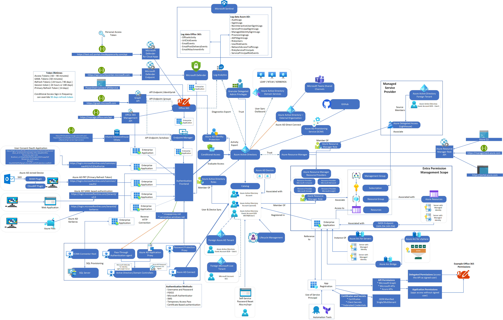

---
layout: post
title:  "Links from my inbox 2023-03-25"
date:   2023-03-25T09:36:00-07:00
categories: links
---


## Good Reads

2023-03-24 [Juice](https://garden.bradwoods.io/notes/design/juice)

> **Juice** is the **non-essential visual, audio & haptic effects that enhance the player's experience**. For example, the delightful chimes sound that plays when Mario collects a mushroom. The 1UP text that appears is essential.
>
> 

2023-03-23 [GOTOphobia considered harmful (in C)](https://blog.joren.ga/gotophobia-harmful)

> The main points of this article are:
> - The fear of using the `goto` statement in programming is called "gotophobia" and is usually caused by misunderstanding and lack of context.
> - Dijkstra's "go to statement considered harmful" was written in the 60s when `goto` was the main method of flow control, but now programmers tend to avoid using `goto` even when it's appropriate.
> - Using `goto` over short distances with well-documented labels can be more effective, faster, and cleaner than other constructs.
> - The article presents some situations and patterns where `goto` could be an acceptable choice and discusses `goto`-less alternatives and their potential drawbacks.
>
> The article:
> - GOTOphobia considered harmful (in C)
> - Resources
> - Error/exception handling & cleanup
> - Restart/retry
> - Less trivial example
> - Common code in switch statement
> - Nested break, labeled continue
> - Simple state machines
> - Jumping into event loop
> - Optimizations
> - Structured Programming with go to Statements

2023-03-18 [The Contentious Art of Pull Requests - DEV Community](https://dev.to/bytebodger/the-contentious-art-of-pull-requests-f3)

> 
> This article discusses the benefits and downsides of code reviews and pull requests. The author argues that git has greatly improved the code review process, but also acknowledges that developers can be snarky and opinionated. The author shares their own “Pull Request Rules” to help mitigate these downsides, including defining/enforcing code styling in the linter and being cautious when making bold statements on someone’s pull request. See also from this series: [Codility === Sadness - DEV Community](https://dev.to/bytebodger/codility-sadness-4of0)


## Fun

2023-03-25 [Floor796](https://floor796.com/#t1l1,312,25)

> Animated isometric madness
>
> 


## C++

2023-03-24 [ww898/utf-cpp: UTF-8/16/32 C++11 header only library for Windows / Linux / MacOs](https://github.com/ww898/utf-cpp)

> C++ UTF library with permissive licensing (MIT). Used in Far2L

2023-03-18 [CppCon 2018: Bob Steagall “Fast Conversion From UTF-8 with C++, DFAs, and SSE Intrinsics” - YouTube](https://www.youtube.com/watch?v=5FQ87-Ecb-A)
  > Slides: 2023-03-18 [CppCon2018/Presentations/fast_conversion_from_utf8_with_cpp_dfas_and_sse_intrinsics at master · CppCon/CppCon2018](https://github.com/CppCon/CppCon2018/tree/master/Presentations/fast_conversion_from_utf8_with_cpp_dfas_and_sse_intrinsics)
  > Code:
  > 2023-03-18 [BobSteagall/utf_utils: My work on high-speed conversion of UTF-8 to UTF-32/UTF-16](https://github.com/BobSteagall/utf_utils)
  > Bob Steagall's blog:
  > 2023-03-18 [The State Machine – All Your C++ Are Belong To Us](https://bobsteagall.com/)


## C#

2023-03-20 [How Async/Await Really Works in C# - .NET Blog](https://devblogs.microsoft.com/dotnet/how-async-await-really-works/)

> This article provides an in-depth look at the history, design decisions, and implementation details of async/await in C# and .NET.

```csharp
// To make a method asynchronous, add the 'async' keyword before its return type
// and change its return type to 'Task' or 'Task<T>' if it returns a value of type T
public async Task MyAsyncMethod()
{
    // Use the 'await' keyword before calling an asynchronous method
    // This will make the method wait for the asynchronous operation to complete
    // before continuing execution
    await SomeAsyncMethod();

    // You can also use 'await' with a Task object
    Task myTask = SomeAsyncMethod();
    await myTask;

    // You can use 'await' in a loop to wait for multiple asynchronous operations
    foreach (var item in myCollection)
    {
        await SomeAsyncMethod(item);
    }

    // You can use 'Task.WhenAll' to wait for multiple asynchronous operations to complete
    Task[] tasks = myCollection.Select(item => SomeAsyncMethod(item)).ToArray();
    await Task.WhenAll(tasks);
}
```


## Web

2023-03-18 [Create and download text files using JavaScript — Amit Merchant — A blog on PHP, JavaScript, and more](https://www.amitmerchant.com/create-and-download-text-files-using-javascript/)

```js
function saveTextAsFile(textToWrite, fileNameToSaveAs, fileType) {
    let textFileAsBlob = new Blob([textToWrite], { type: fileType });
    let downloadLink = document.createElement('a');
    downloadLink.download = fileNameToSaveAs;
    downloadLink.innerHTML = 'Download File';

    if (window.webkitURL != null) {
        downloadLink.href = window.webkitURL.createObjectURL(
            textFileAsBlob
        );
    } else {
        downloadLink.href = window.URL.createObjectURL(textFileAsBlob);
        downloadLink.style.display = 'none';
        document.body.appendChild(downloadLink);
    }

    downloadLink.click();
}
```

> 


## Typescript

2023-03-19 ⭐ [Functional Programming with TypeScript - YouTube](https://www.youtube.com/playlist?list=PLuPevXgCPUIMbCxBEnc1dNwboH6e2ImQo)

> 


## GPT Prompts

> ChatGPT, ChatGPT, ChatGPT, ChatGPT, ChatGPT, ChatGPT, ChatGPT, ChatGPT, ChatGPT, ChatGPT, ChatGPT, ChatGPT, ChatGPT, ChatGPT, ChatGPT, ChatGPT, ChatGPT, ChatGPT, ChatGPT, ChatGPT, ChatGPT, ChatGPT, ChatGPT, ChatGPT, ChatGPT, ChatGPT, ChatGPT, ChatGPT, ChatGPT, ChatGPT, ChatGPT, ChatGPT, ChatGPT, ChatGPT, 

2023-03-18 [f/awesome-chatgpt-prompts: This repo includes ChatGPT prompt curation to use ChatGPT better.](https://github.com/f/awesome-chatgpt-prompts)

2023-03-18 [humanloop/awesome-chatgpt: Curated list of awesome tools, demos, docs for ChatGPT and GPT-3](https://github.com/humanloop/awesome-chatgpt)

2023-03-18 [yokoffing/ChatGPT-Prompts: ChatGPT and Bing AI prompt curation](https://github.com/yokoffing/ChatGPT-Prompts)

2023-03-18 [promptslab/Awesome-Prompt-Engineering: This repository contains a hand-curated resources for Prompt Engineering with a focus on Generative Pre-trained Transformer (GPT), ChatGPT, PaLM etc](https://github.com/promptslab/Awesome-Prompt-Engineering)


## Azure Active Directory

2023-03-18 ⭐ [Azure Active Directory - Security Overview - msandbu.org](https://msandbu.org/azure-active-directory-security-overview/)

> After working with Azure AD for a **looong** time I always forget how complex it has gotten over the years, with all the new features and capabilities that have been introduced.
>
> Therefore, I decided that I wanted to create an overview of the endpoints/integrations/connections/features in the ecosystem. Mostly for myself but hopefully it can be useful for others as well to get a glimpse at all the features in the service. I will be during the next couple of weeks be adding information about the different endpoints and services here as well so that people can get a bit more detailed description of the unique features as well.
>
> **Download the VISIO Here –> https://bit.ly/3fTEZHK**
>
> **Download the PNG Here –> https://bit.ly/3T5NT3y**
>
> Archived image (right click / open in new tab to make larger):
> 

> 

## Video

2023-03-23 [mifi/lossless-cut: The swiss army knife of lossless video/audio editing](https://github.com/mifi/lossless-cut)

> LosslessCut aims to be the ultimate cross platform FFmpeg GUI for extremely fast and lossless operations on video, audio, subtitle and other related media files. The main feature is lossless trimming and cutting of video and audio files, which is great for saving space by rough-cutting your large video files
>
> 


