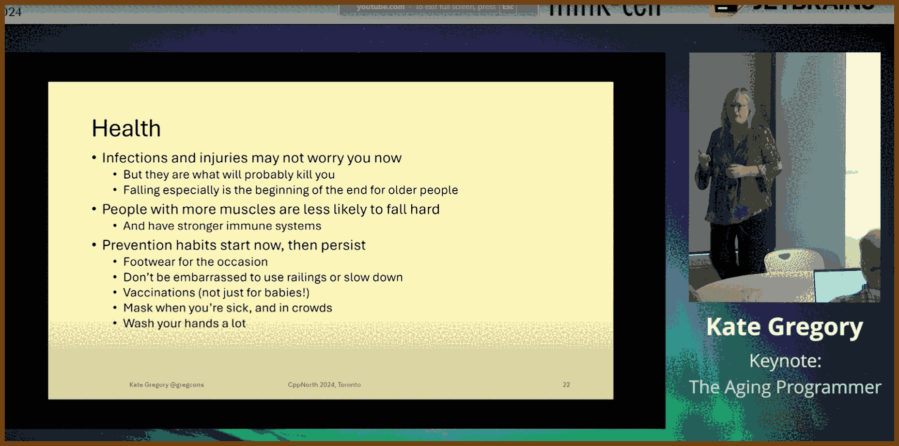

---
layout: post
title:  "Links from my inbox 2024-11-24"
date:   2024-11-24T12:25:00-08:00
categories: links
---

## ⌚ Nice watch!

2024-11-24 [Keynote: The Aging Programmer - Kate Gregory - YouTube](https://www.youtube.com/watch?v=LArOT95LTJU) { www.youtube.com }

> 
>
> Maintain **vision health** by getting regular eye check-ups, using appropriate glasses, and addressing night driving challenges with clean windshields and adaptive lighting.
>
> Build **physical strength and stamina** by incorporating strength training (e.g., push-ups, squats) and aerobic activities like walking or biking into daily life.
>
> Reduce **pain and joint issues** with anti-inflammatories like naproxen as needed and by focusing on flexibility and range-of-motion exercises.
>
> Protect **hearing** through regular hearing tests starting at age 50, using hearing aids if necessary, and avoiding loud environments or overly high headphone volumes.
>
> Improve **nutrition** by prioritizing fruits, vegetables, and whole foods while limiting ultra-processed items. Eat meals made with care and hydrate appropriately.
>
> Enhance **sleep quality** by focusing on creating a comfortable sleep environment (“sleep joy”) and getting the amount of rest your body needs without guilt.
>
> Safeguard **brain health** using organizational strategies, pursuing lifelong learning, and embracing new tools and technologies to stay sharp.
>
> Foster **emotional resilience** by prioritizing gratitude and optimism, avoiding unnecessary negativity, and working toward a calm and joyful outlook.
>
> Adapt to **changes in ability** by recognizing limitations as they arise and addressing them proactively with tools, technology, and support systems.
>
> Combat **workplace biases** against older programmers by emphasizing your experience, exploring consulting or freelancing, and pushing back against assumptions about learning capacity.
>
> Plan for **retirement** by calculating your financial “number,” balancing saving with enjoying the present, and planning meaningful activities to avoid boredom and isolation.
>
> Improve **work-life balance** through flexible work arrangements, prioritizing health, and focusing on work that aligns with your values and passions.
>
> Build **relationships** by maintaining friendships across generations and engaging with new communities through hobbies, volunteering, or neighborhood activities.
>
> Prevent **loneliness** by cultivating social engagement in retirement through structured activities, regular interactions, or volunteering.
>
> Develop **healthy habits** by avoiding smoking, using sunscreen, and embracing preventive measures like vaccinations.
>
> Incorporate **joy and play** into daily life through hobbies, nature, and small pleasures, focusing on activities that spark happiness and relaxation.
>
> Create a **lasting legacy** by organizing and preserving personal and professional projects, ensuring they are meaningful and accessible for others.
>
> Handle **loss and change** by accepting the inevitability of loss while actively seeking new experiences and connections to balance those losses.
>
> Address **unexpected challenges** by consulting professionals for new or worsening health issues, as not all problems stem from aging.
>
> Reflect on **life purpose** and make choices that align with long-term happiness and fulfillment.
>
> Exercise regularly to support both physical and mental well-being.
>
> Save for the future while enjoying life in the present.
>
> Stay socially engaged through hobbies, work, or volunteering.
>
> Eat a balanced diet and focus on whole foods for overall health.
>
> Adapt to limitations by embracing tools and strategies that maintain independence.
>
> Build friendships across generations for mutual support and enrichment.
>
> Cultivate a sense of purpose through meaningful work or activities.
>
> Kate Gregory’s message emphasizes that aging well—whether as a programmer or in any field—requires proactive effort, adaptability, and a focus on joy and purpose.

2024-11-23 [My Own Nightmare HR Manager Story (Tip: Every Company Has An A-Hole) - YouTube](https://www.youtube.com/watch?v=ltTW5NNTaS4) { www.youtube.com }

> 
>
> In every workplace, you’ll encounter a corporate jerk—the kind of person who thrives on creating chaos, manipulating others, and throwing people under the bus. These individuals are frustrating, but they don’t have to define your career. Let me share a condensed version of my experience dealing with one and the key strategies I used to handle it.
>
> I took on a senior recruiter role with an RPO organization, filling high-level positions nationwide. Before my official role started, I was asked to temporarily support a chaotic plant with high turnover. From the start, the HR manager at the plant undermined my work, deviated from processes, and made false accusations to my boss about my performance. Despite the challenges, I stayed professional and focused on achieving results.
>
> Later, when assigned to the same plant for senior-level roles, the HR manager again tried to sabotage me. This time, I was ready. Armed with detailed documentation of every interaction, I exposed her dishonesty, which damaged her credibility. Though the plant's issues persisted, I didn’t let her behavior derail me. Shortly after, I moved on to a better opportunity, taking invaluable lessons with me.
>
> **Lessons Learned**
>
> 1. **Document Everything:** Keep detailed records of all interactions and deliverables. These become your safety net against false accusations.
> 2. **Maintain Professionalism:** Stay composed and formal in your interactions. Don’t stoop to their level.
> 3. **Set Boundaries:** Be clear about your role and responsibilities. Don’t let others exploit your flexibility.
> 4. **Don’t Internalize Their Behavior:** Their actions are a reflection of their own issues, not your worth or abilities.
>
> Corporate jerks are an unavoidable reality in most workplaces, but they don’t have to define your career. Use strategy, stay professional, and remember: you’re in control of your trajectory—not them. When necessary, don’t hesitate to move on to an environment where you can thrive.

2024-11-23 [JavaScript in places you didn’t expect - YouTube](https://www.youtube.com/watch?v=tQ6fB7WClgw) { www.youtube.com }

> 
>
> JavaScript is everywhere—from browsers to unexpected platforms like game consoles and operating systems. Despite its quirks and criticisms, its versatility has made it indispensable. This post is for developers and tech enthusiasts curious about how JavaScript extends beyond typical web applications, influencing industries like gaming, desktop environments, and more.
>
> **JavaScript Beyond Browsers**
> JavaScript is not just a browser language anymore. From GNOME’s desktop environment in Linux, which is almost 50% JavaScript, to Windows 11’s React Native-powered start menu and recommended sections, it’s embedded in operating systems. Even the PlayStation 5 relies heavily on React Native for its interface.
>
> **JavaScript in Gaming Consoles**
> Microsoft’s Xbox and Sony’s PlayStation both integrate React Native into their systems. Historically, web technologies like HTML were also used (e.g., Nintendo Wii’s settings menu), showing a longstanding trend of leveraging web tech for ease of development in consoles.
>
> **Gaming and UI Layers**
> Even major game titles like *Battlefield 1* use JavaScript and React for their UI layers, thanks to tools like MobX for state management. Developers appreciate its flexibility in managing complex UI interactions over building bespoke solutions.
>
> **Game Development: JavaScript vs. C++**
> *Vampire Survivors* showcases a fascinating dual approach: its browser-based JavaScript version serves as the prototype, while a team ports it to C++ for consoles. This method ensures performance optimization without sacrificing the rapid development benefits of JS.
>
> **React’s Evolution and Adaptation**
> React Lua, originally a Roblox project, brings React’s paradigms to Lua-based environments. This shows how React’s influence transcends JavaScript, becoming a staple for creating UIs even in non-JS ecosystems.
>
> **Why JavaScript?**
> JavaScript enables faster iteration, broader developer accessibility, and reduced specialization needs. Whether it’s GNOME choosing it for extensibility or game studios adopting React for UI efficiency, its ubiquity stems from practical needs.

2024-11-18 [The Most Important API Design Guideline - No, It's Not That One - Jody Hagins - C++Now 2024 - YouTube](https://www.youtube.com/watch?v=xzIeQWLDSu4) { www.youtube.com }

> This talk is fun, but more like theoretical and philosophical. 
>
> 
> 
>
> 
>
> ---

📝 **Property-Based Testing for Joining an Array to a String with Delimiter in C++**

**Definition**  
Property-based testing involves specifying general properties a function should satisfy for a wide range of inputs. In this example, we will test a function that joins an array of strings with a delimiter into a single string. The properties we want to validate are:

1. The delimiter should only appear between elements, not at the start or end.
2. If the array has one element, the result should be the element itself without the delimiter.
3. An empty array should produce an empty string.

**C++ Code Example using `rapidcheck`**

Here’s a property-based test using the `rapidcheck` library in C++ to test a `join` function that joins a vector of strings with a specified delimiter:

```cpp
#include <rapidcheck.h>
#include <string>
#include <vector>
#include <sstream>
#include <iostream>

// Function to join array with a delimiter
std::string join(const std::vector<std::string>& elements, const std::string& delimiter) {
    std::ostringstream os;
    for (size_t i = 0; i < elements.size(); ++i) {
        os << elements[i];
        if (i != elements.size() - 1) { // Avoid trailing delimiter
            os << delimiter;
        }
    }
    return os.str();
}

int main() {
    rc::check("Joining should produce a correctly delimited string", [](const std::vector<std::string>& elements, const std::string& delimiter) {
        std::string result = join(elements, delimiter);

        // Property 1: The delimiter should appear only between elements
        if (elements.size() > 1 && !delimiter.empty()) {
            // Split result by delimiter and check the components match the input
            std::vector<std::string> parts;
            std::string::size_type start = 0, end;
            while ((end = result.find(delimiter, start)) != std::string::npos) {
                parts.push_back(result.substr(start, end - start));
                start = end + delimiter.length();
            }
            parts.push_back(result.substr(start));

            // Assert parts match elements
            RC_ASSERT(parts == elements);
        }

        // Property 2: If there's only one element, the result should match that element directly
        if (elements.size() == 1) {
            RC_ASSERT(result == elements[0]);
        }

        // Property 3: If the array is empty, the result should be an empty string
        if (elements.empty()) {
            RC_ASSERT(result.empty());
        }
    });

    return 0;
}
```

Notice that `rc::check` will run the test 100 times with different random input parameters. In case of failure, it will give the configuration and random seed info for debugging in output. 

**Explanation of Example**  

1. **Property 1:** Ensures that if multiple elements are joined with a delimiter, the delimiter only appears between elements, not at the start or end.
2. **Property 2:** Checks that if the array has only one element, the function returns the element itself without any delimiter.
3. **Property 3:** Confirms that if the input array is empty, the output string is empty.

This approach guarantees that the `join` function works as expected across diverse inputs, making it more robust against edge cases such as empty arrays, single-element arrays, and unusual delimiter values.

**Links**

2024-11-18 [emil-e/rapidcheck: QuickCheck clone for C++ with the goal of being simple to use with as little boilerplate as possible.](https://github.com/emil-e/rapidcheck) { github.com }

---

2024-11-19 [Stop Solving Problems for Your Development Team! - YouTube](https://www.youtube.com/watch?v=XuCGItsAHXQ) { www.youtube.com }

> 
>
> 
>
> ---
>
> For technical leaders, the balance between leading effectively and empowering their team can be challenging. Whether you’re a software engineer managing junior developers or a product owner guiding associates, the traditional approach of “just give the answer” can lead to dependency and frustration for both you and your team. This post explores the value of coaching-driven leadership—a method that empowers your team to become self-sufficient, creative problem-solvers. If you’re in any technical or managerial role, understanding how to guide without micromanaging is essential. Learn how adopting a coaching approach can transform your team’s efficiency, autonomy, and collaboration.
>
> **The Shift from Solving Problems to Empowering People**
>
> A coaching-based leadership style redefines how leaders approach problem-solving with their teams. Instead of quickly providing answers to move tasks along, this approach encourages team members to develop the skills to tackle issues independently, ultimately creating a more resilient and capable workforce. Below are some key insights and advice on how to lead through empowerment:
>
> **Encouraging Self-Reliance Instead of Dependency**
>
>    - **Why It Matters**: When leaders constantly solve problems for others, it builds dependency. Empowering team members to find their own solutions helps reduce your stress and increases their confidence.
>    - **How to Do It**: Encourage team members to exhaust all possible resources and approaches before coming to you. Ask questions like, “How would you solve this if I weren’t available?” This encourages them to think independently.
>
> **Asking Powerful, Resourceful Questions**
>
> - **Why It Matters**: A quick solution often leads to repeated questions. When leaders ask resourceful questions, they prompt team members to analyze and solve problems on their own.
> - **How to Do It**: Instead of offering solutions, ask questions that challenge their thought processes. Examples include: 
>   - “What other approaches have you considered❓️” 
>   - “Can this problem be broken down into smaller tasks❓️” 
>
>
> This approach builds critical thinking and problem-solving skills.
>
> **Fostering a Growth-Oriented Mindset**
>
>    - **Why It Matters**: Viewing team members as capable individuals with potential is essential. By recognizing and nurturing their strengths, leaders can help people grow into their roles more effectively.
>    - **How to Do It**: Reframe your thinking to see team members as resourceful and capable. Focus on their potential and ask questions that encourage them to broaden their perspectives, such as, “What new solutions might you try if you had more resources?”
>
> **Prioritizing Long-Term Gains Over Short-Term Fixes**
>
>    - **Why It Matters**: Quick answers may solve today’s problem, but they build future dependency. Investing in a coaching style fosters autonomy, saving time and stress in the long run.
>    - **How to Do It**: Resist the urge to provide immediate solutions. Instead, encourage team members to analyze challenges thoroughly, which leads to more sustainable growth and resilience.
>
> **Practical Applications of Coaching in Technical Leadership**
>
> For leaders looking to implement these coaching principles, here are specific areas where a coaching mindset can be applied effectively:
>
>    - **Code Reviews**: Instead of dictating how code should look, ask questions about their logic and problem-solving approach. This not only ensures quality but also deepens their understanding.
>    - **Design and Project Reviews**: Use design critiques as opportunities to help team members articulate their design choices, fostering a culture of open dialogue and improvement.
>    - **Debugging and Troubleshooting**: When assisting with debugging, ask team members to consider alternative solutions or explain their thought process rather than simply fixing the problem.
>    - **Project Planning**: Encourage team members to independently explore solutions to potential obstacles by asking them to consider all options and resources available.

2024-11-24 [How regexes got catastrophic - YouTube](https://www.youtube.com/watch?v=gITmP0IWff0) { www.youtube.com }

> 
>
> ### **Introduction**
>
> Regular expressions (regexes) are a foundational tool in programming, celebrated for their ability to match patterns efficiently and elegantly. However, their widespread use has exposed critical flaws in how they are implemented in most programming environments. What begins as a theoretical marvel often translates into real-world inefficiencies and vulnerabilities, leading to catastrophic outcomes like server crashes from regex denial of service (ReDoS) attacks.
>
> This post unpacks the evolution of regex algorithms, contrasts their efficiency, and explores how poor implementation choices have led to systemic issues. Whether you're a systems programmer, web developer, or curious about computational theory, understanding regex's hidden complexities will change how you approach pattern matching.
>
> **1. The Two Faces of Regex Algorithms**
>
> Regex engines typically rely on two main algorithms: the **lockstep algorithm** (also known as Thompson's algorithm) and **backtracking**. Here's how they stack up:
>
> - **Lockstep Algorithm**: This algorithm operates with predictable performance, scaling quadratically in worst-case scenarios and linearly when scaling only input size. It treats all possible paths through a regex simultaneously, avoiding exponential blowups.
> - **Backtracking Algorithm**: While intuitive and flexible (especially for complex features like backreferences and capturing groups), backtracking scales exponentially in the worst case. This flaw enables catastrophic backtracking, where a regex takes impractically long to resolve, even on short inputs.
>
> **2. Exponential Backtracking in Practice**
>
> Using backtracking means every possible path through a regex is explored individually. When paths multiply exponentially—such as in nested structures or poorly constructed patterns—the execution time balloons. For instance:
>
> - A regex engine using backtracking may take **24 ticks** to match a complex string, compared to only **18 ticks** with the lockstep algorithm.
>
> **3. Historical Decisions with Long-Lasting Impacts**
>
> The dominance of backtracking stems from historical choices made during the development of early Unix utilities:
>
> - **Ken Thompson**, the creator of regexes, implemented a lockstep-based engine in the 1960s. However, later tools like `ed` and `grep` shifted to backtracking, prioritizing simplicity and flexibility over performance.
>
> This decision, compounded by the introduction of features like backreferences and greedy quantifiers, locked most regex engines into backtracking implementations. Over time, these became embedded in standard libraries across programming languages, making lockstep a rarity.
>
> **4. Regex Denial of Service (ReDoS)**
>
> The vulnerability of backtracking manifests starkly in ReDoS attacks:
>
> - A specially crafted regex input can force an engine to explore every possible path, consuming excessive CPU cycles and halting services.
> - Examples include outages at **Stack Exchange (2016)** and **Cloudflare (2019)** due to poorly constructed regexes handling unexpected inputs.
>
> **5. Features That Complicate Performance**
>
> While features like **capturing groups**, **backreferences**, and **non-greedy modifiers** add functionality, they exacerbate backtracking's inefficiencies. For instance:
>
> - Capturing groups in backtracking engines are straightforward but introduce state-tracking complexities in lockstep implementations.
> - Backreferences break the theoretical constraints of regular languages, making efficient lockstep implementations infeasible.
>
> **6. Modern Solutions**
>
> Some modern regex engines, like Google's **RE2**, abandon backtracking altogether, focusing on performance and predictability. RE2 enforces strict adherence to regular language constraints, ensuring linear or quadratic time complexity.
>
> While sacrificing backreferences and some advanced features, engines like RE2 are critical for applications requiring robust and reliable performance, such as large-scale web services.
