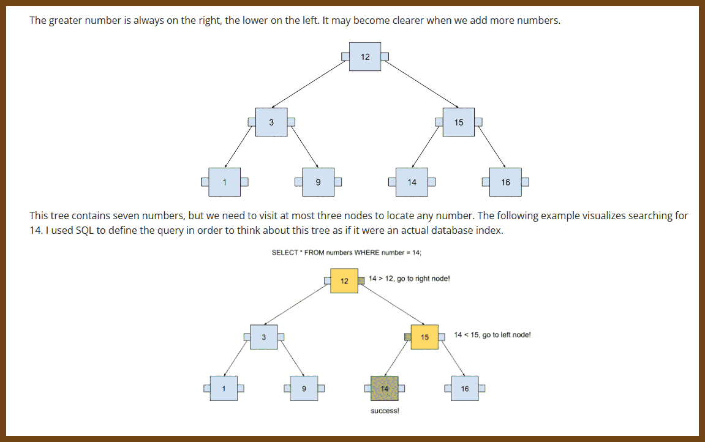
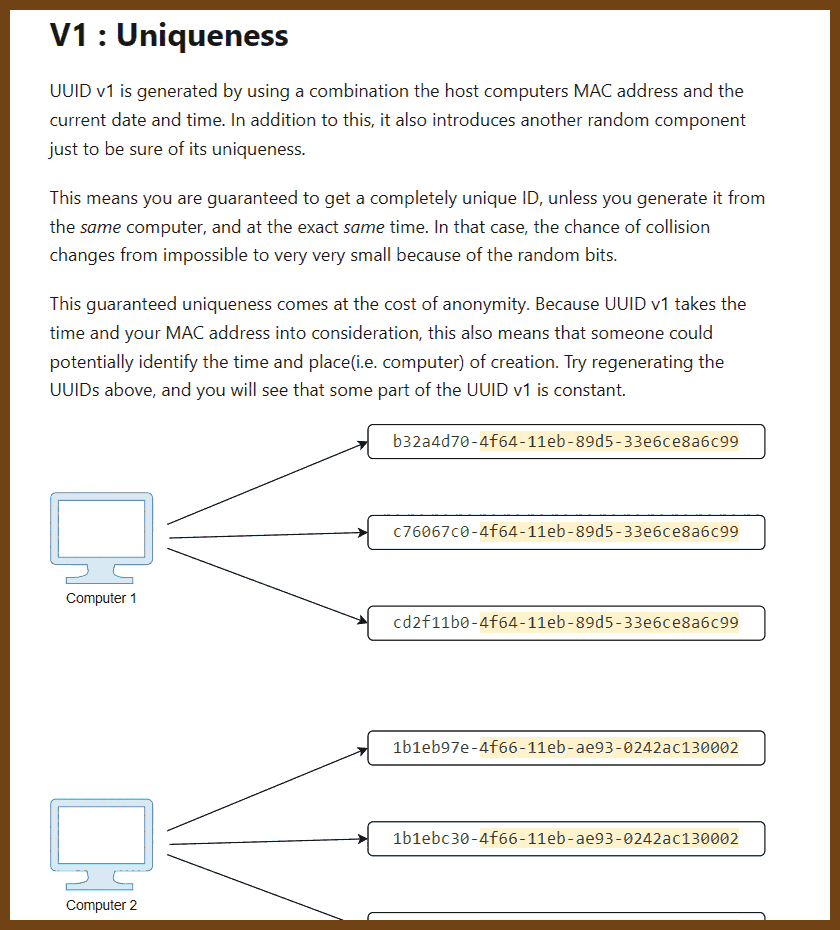
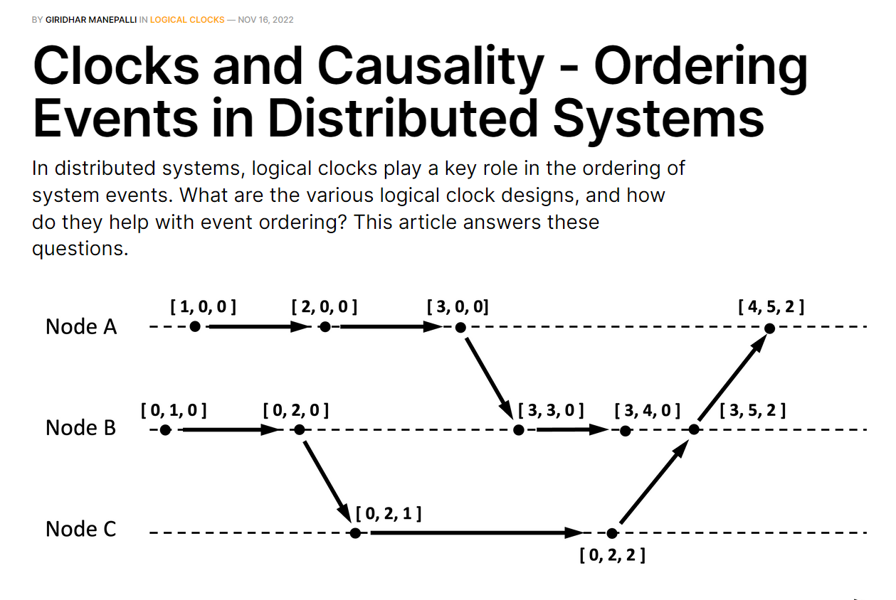
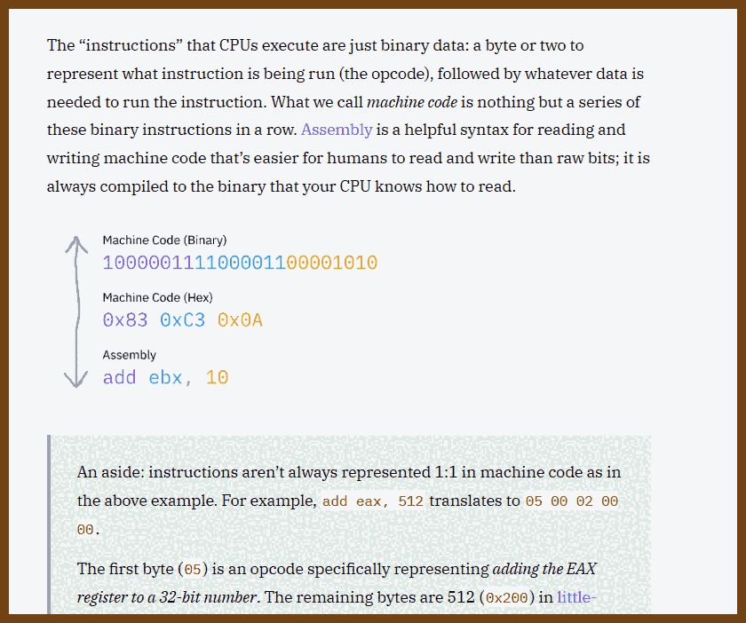
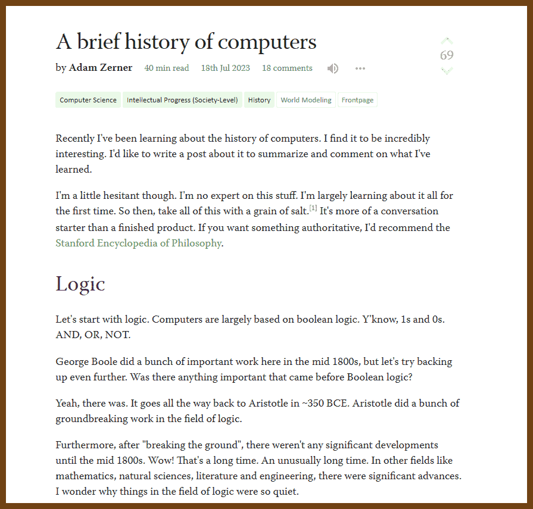
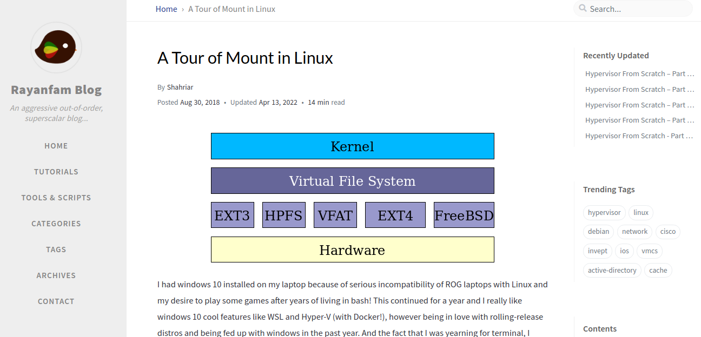
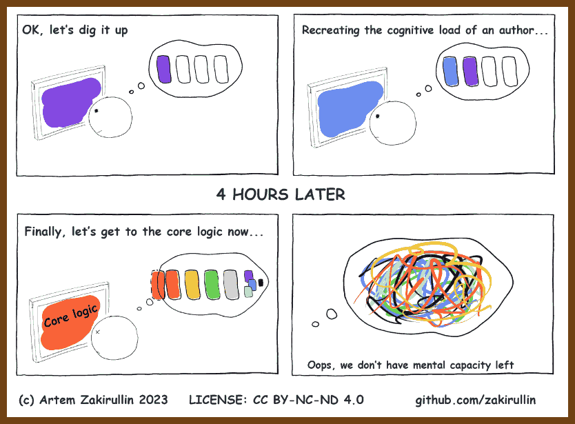
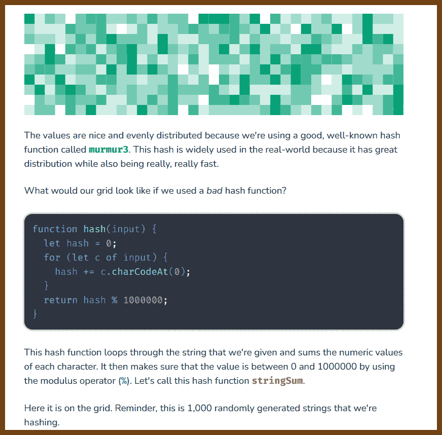
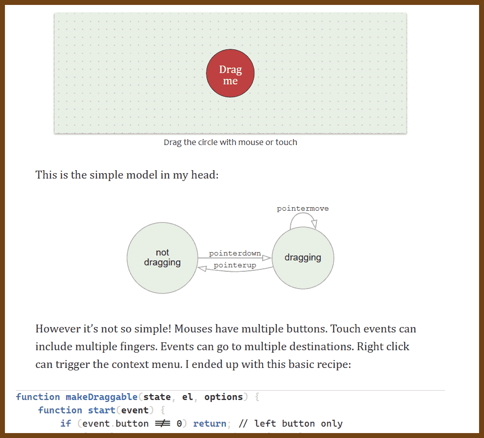

## Classics of software development

- 2022-03-04 [Numbers Every Programmer Should Know By Year](https://colin-scott.github.io/personal_website/research/interactive_latency.html)

- 2022-02-13 [The Life of MS-DOS · Brendan's Website](https://b13rg.github.io/Life-of-MS-DOS/)
> First released on August 12, 1981, MS-DOS became the foundation for business computing for almost two decades. MS-DOS stood for Microsoft Disk Operating System and was often referred to simply as “DOS”.

## How the thing work

- 2023-12-23 [How does B-tree make your queries fast? · allegro.tech](https://blog.allegro.tech/2023/11/how-does-btree-make-your-queries-fast.html) 

  > **B-tree** is a structure that helps to search through great amounts of data. It was invented over 40 years ago, yet it is still employed by the majority of modern databases. Although there are newer index structures, like LSM trees, **B-tree** is unbeaten when handling most of the database queries.
  >
  > After reading this post, you will know how **B-tree** organises the data and how it performs search queries.

  > 

  

- 2023-11-05 [A Complete Guide to UUID Versions (v1, v4, v5) - With Examples](https://www.sohamkamani.com/uuid-versions-explained/)

> This post will describe UUID v1, v4, and v5, with examples. We will go through their implementation and differences, and when you should use them.

> 

- 2022-02-13 [Paul Butler – What does it mean to listen on a port?](https://paulbutler.org/2022/what-does-it-mean-to-listen-on-a-port/)

> In the corner of the student union building there is a coffee shop, and in the corner of the coffee shop are two students. Liz taps away at the keyboard of the battered hand-me-down MacBook her brother gave her when she moved away to college. To her left on the bench seat, Tim scrawls equations on a coil-bound notebook. Between them is a half-empty cup of room temperature coffee that Liz sporadically sips from to stay awake.
- 2022-01-28 [Hive: A Globally-Distributed Key/Value Store](https://papers.s3.fr-par.scw.cloud/hive.pdf) -
This paper reports our experience creating, developing, and deploying a globally distributed key-value store intended as
a database backend for our S3 API, Hive. Hive is a system to distribute data on a global scale, with various desired
consistency, replication, and database sharding for linear read and write latency.
- 2022-05-14 [Time-series compression algorithms, explained](https://www.timescale.com/blog/time-series-compression-algorithms-explained/)
> Delta-delta encoding, Simple-8b, XOR-based compression, and more - These algorithms aren't magic, but combined they can save over 90% of storage costs and speed up queries. Here’s how they work.
- 2022-05-22 [Dictionary implementation in C# - Dotnetos - courses & conferences about .NET](https://dotnetos.org/blog/2022-03-28-dictionary-implementation/)
> In the previous post we explained the [implementation details](https://dotnetos.org/blog/2022-03-07-list-implementation/) of `List<T>`. This time we will look at another generic collection defined in `System.Collection.Generic` namespace which is `Dictionary<TKey TValue>`.
- 2022-05-08 [Modern Microprocessors - A 90-Minute Guide!](https://www.lighterra.com/papers/modernmicroprocessors/)
> A brief, pulls-no-punches, fast-paced introduction to the main design aspects of modern processor microarchitecture.

- 2023-04-07 [How does database sharding work?](https://planetscale.com/blog/how-does-database-sharding-work)

> 2023-04-07 [Database “sharding” came from UO? – Raph's Website](https://www.raphkoster.com/2009/01/08/database-sharding-came-from-uo/)
> 

- 2023-04-03 [Database Sharding Explained](https://architecturenotes.co/database-sharding-explained/)

> This article explains what database sharding is, how it works, and the best ways to use it. It also talks about the potential server architectures and data layout. The article is written in a clear and concise manner with examples and comparisons to help readers understand the concept of database sharding better.

> 

- 2023-04-01 [Clocks and Causality - Ordering Events in Distributed Systems](https://www.exhypothesi.com/clocks-and-causality/)

> 

- 2023-07-22 [The "Basics" | Putting the "You" in CPU](https://cpu.land/the-basics)

> 

- 2023-07-22 [A brief history of computers — LessWrong](https://www.lesswrong.com/posts/vfRpzyGsikujm9ujj/a-brief-history-of-computers)

> 
>
> 

- 2023-09-25 [A Hackers' Guide to Language Models - YouTube](https://www.youtube.com/watch?v=jkrNMKz9pWU)

> Explains how LLM work

- 2023-09-25 [Practical Deep Learning for Coders - Practical Deep Learning](https://course.fast.ai/)

  > 

- 2023-08-27 [Normcore LLM Reads](https://gist.github.com/veekaybee/be375ab33085102f9027853128dc5f0e)

> Anti-hype LLM reading list
> Goals: Add links that are reasonable and good explanations of how stuff works. No hype and no vendor content if possible. Practical first-hand accounts and experience preferred (super rare at this point).

> - [Generative Interfaces Beyond Chat (YouTube)](https://www.youtube.com/watch?v=rd-J3hmycQs)

> - [Why Chatbots are not the Future](https://wattenberger.com/thoughts/boo-chatbots)
>
> 


- 2023-09-20 🐇 [RabbitMQ vs. Kafka - An Architect's Dilemma (Part 1) - Eran Stiller](https://eranstiller.com/rabbitmq-vs-kafka-an-architects-dilemma-part-1)

> 


## Metadata Blog

> On distributed systems broad ly defined and other curiosities. The opinions on this site are my own.

- [TiDB: A Raft-based HTAP Database](https://muratbuffalo.blogspot.com/2023/10/tidb-raft-based-htap-database.html)
- [Metastable failures in the wild](https://muratbuffalo.blogspot.com/2023/09/metastable-failures-in-wild.html)

> This paper appeared in OSDI'22. There is a great summary of the paper by Aleksey (one of the authors and my former PhD student, go Aleksey!). There is also a great conference presentation video from Lexiang. Below I will provide a brief overview of the paper followed by my discussion points.

- [Distributed Transactions at Scale in Amazon DynamoDB](https://muratbuffalo.blogspot.com/2023/08/distributed-transactions-at-scale-in.html)

> This paper appeared in July at USENIX ATC 2023. If you haven't read about the architecture and operation of DynamoDB, please first read my summary of the DynamoDB ATC 2022 paper . The big omission in that paper was discussion about transactions. This paper amends that. It is great to see DynamoDB, and AWS in general, is publishing/sharing more widely than before.

- [Detock: High Performance Multi-region Transactions at Scale (Sigmod 2023)](https://muratbuffalo.blogspot.com/2023/07/detock-high-performance-multi-region.html)

> This paper (from Sigmod 2023) is a followup to the deterministic database work that Daniel Abadi has been doing for more than a decade. I like this type of continuous research effort rather than people jumping from one branch to another before exploring the approach in depth.
>
> The backstory for Detock starts with the Calvin paper from 2012. Calvin used a single logically centralized infallible coordinator (which is in fact 3 physical nodes under the raincoat using Paxos for state machine replication) to durably lock-in on the order of oplogs to be executed. The coordinator also gets rid of nondeterminism sources like random or time by filling in those values. The oplogs then get sent to the workers that execute them and materialize the values. The execution is local, where the executors simply follow the logs they receive.

- [Characterizing Microservice Dependency and Performance: Alibaba Trace Analysis](https://muratbuffalo.blogspot.com/2023/03/characterizing-microservice-dependency.html)

> This paper got the best paper award at SOCC 2021. The paper conducts a comprehensive study of large scale microservices deployed in Alibaba clusters.  They analyze the behavior of more than 20,000 microservices in a 7-day period and profile their characteristics based on the 10 billion call traces collected.

- [SQLite: Past, Present, and Future](https://muratbuffalo.blogspot.com/2022/09/sqlite-past-present-and-future.html)

> SQLite is the most widely deployed database engine (or likely even software of any type) in existence. It is found in nearly every smartphone (iOS and Android), computer, web browser, television, and automobile. There are likely over one trillion SQLite databases in active use. (If you are on a Mac laptop, you can open a terminal, type "sqlite3", and start conversing with the SQLite database engine using SQL.)
> SQLite is a single node and (mostly) single threaded online transaction processing (OLTP) database. It has an in-process/embbedded design, and a standalone (no dependencies) codebase ...a single C library consisting of 150K lines of code.  With all features enabled, the compiled library size can be less than 750 KiB. Yet, SQLite can support tens of thousands of transactions per second. Due to its reliability, SQLite is used in mission-critical applications such as flight software. There are over 600 lines of test code for every line of code in SQLite. SQLite is truly the little database engine that could.

- [Warp: Lightweight Multi-Key Transactions for Key-Value Stores](https://muratbuffalo.blogspot.com/2022/05/warp-lightweight-multi-key-transactions.html)

> This paper introduces a simple yet powerful idea to provide efficient multi-key transactions with ACID semantics on top of a sharded NoSQL data store. The Warp protocol prevents serializability cycles forming between concurrent transactions by forcing them to serialize via a chain communication pattern rather than using a parallel 2PC fan-out/fan-in communication. This avoids hotspots associated with fan-out/fan-in communication and prevents wasted parallel work from contacting multiple other servers when traversing them in serial would surface an invalidation/abortion early on in the serialization. I love the elegance of this idea.


## Hypervisors and Operating Systems

2024-08-31 [Hypervisor From Scratch - Part 1: Basic Concepts & Configure Testing Environment | Rayanfam Blog](https://rayanfam.com/topics/hypervisor-from-scratch-part-1/) { rayanfam.com }

> > # Hypervisor From Scratch
> >
> > - [Hypervisor From Scratch – Part 1: Basic Concepts & Configure Testing Environment](https://rayanfam.com/topics/hypervisor-from-scratch-part-1/)
> > - [Hypervisor From Scratch – Part 2: Entering VMX Operation](https://rayanfam.com/topics/hypervisor-from-scratch-part-2/)
> > - [Hypervisor From Scratch – Part 3: Setting up Our First Virtual Machine](https://rayanfam.com/topics/hypervisor-from-scratch-part-3/)
> > - [Hypervisor From Scratch – Part 4: Address Translation Using Extended Page Table (EPT)](https://rayanfam.com/topics/hypervisor-from-scratch-part-4/)
> > - [Hypervisor From Scratch – Part 5: Setting up VMCS & Running Guest Code](https://rayanfam.com/topics/hypervisor-from-scratch-part-5/)
> > - [Hypervisor From Scratch – Part 6: Virtualizing An Already Running System](https://rayanfam.com/topics/hypervisor-from-scratch-part-6/)
> > - [Hypervisor From Scratch – Part 7: Using EPT & Page-Level Monitoring Features](https://rayanfam.com/topics/hypervisor-from-scratch-part-7/)
> > - [Hypervisor From Scratch – Part 8: How To Do Magic With Hypervisor!](https://rayanfam.com/topics/hypervisor-from-scratch-part-8/)
>
> The source code for **Hypervisor From Scratch** is available on GitHub :
>
> [https://github.com/SinaKarvandi/Hypervisor-From-Scratch/]

2024-08-31 [Reversing Windows Internals (Part 1) - Digging Into Handles, Callbacks & ObjectTypes | Rayanfam Blog](https://rayanfam.com/topics/reversing-windows-internals-part1/) { rayanfam.com }

2024-08-31 [A Tour of Mount in Linux | Rayanfam Blog](https://rayanfam.com/topics/mount-in-linux/) { rayanfam.com }

> 


## Some good Articles

- 2022-02-27 [Practical Guide to Solving Hard Problems](https://praeclarum.org/2022/02/19/hard-problems.html?utm_source=programmingdigest&utm_medium=email&utm_campaign=461)
> I sometimes find myself in a position of needing to write some code that I’m just not sure how to write. Been there have you? Here are the steps I take when I’m stumped. No huge revelations here, just hard-earned advice.
- 2022-02-18 ⭐ [6 Months of Working at a Hypergrowth Startup – Jacob Brazeal](https://jacobbrazeal.wordpress.com/2022/02/16/lessons-from-6-months-at-a-hypergrowth-startup-100-prs-40-interviews/)
> I joined Scale AI late last summer. It’s been a crazy experience — Scale is growing incredibly fast right now, hitting a valuation of over $7 billion last year and recently signing a $250 million contract with the DoD. Personally, I’ve made over 100 PRs and conducted about 40 interviews already! It’s also by far the largest company I’ve worked for. Here are some lessons I’ve learned
- 2022-01-26 [Durability and Redo Logging](http://justinjaffray.com/durability-and-redo-logging/)
> The most fundamental property a database can provide is durability. That is, once I’ve told you that your write has been accepted, if a mouse chews through the power cord for the server rack, the write will not be lost.

2023-05-28 [zakirullin/cognitive-load: 🧠 Cognitive Load Developer's Handbook](https://github.com/zakirullin/cognitive-load/)

> Cognitive load
>
> >  **Cognitive load is how much a developer needs to know in order to complete a task.**
>
> We should strive to reduce the cognitive load in our projects as much as possible.
>
> The average person can hold roughly **four facts** in working memory. Once the cognitive load reaches this threshold, a significant effort is required to understand things.
>
> *Let's say we've been asked to make some fixes to a completely unfamiliar project. We were told that a really smart developer had contributed to it. Lots of cool technologies, fancy libraries and trendy frameworks were used. In other words, **the previous author had a high cognitive load in his head, which we are yet to recreate.***

> 

> Inheritance nightmare
>
> We're tasked to change a few things for our admin users: `🧠`
>
> ```
> AdminController extends UserController extends GuestController extends BaseController
> ```
>
> Ohh, part of the functionality is in `BaseController`, let's have a look: `🧠+`
> Basic role mechanics got introduced in `GuestController`: `🧠++`
> Things got partially altered in `UserController`: `🧠+++`
> Finally we're here, `AdminController`, let's code stuff! `🧠++++`
>
> Oh, wait, there's `SuperuserController` which extends `AdminController`. By modifying `AdminController` we can break things in the inherited class, so let's dive in `SuperuserController` first: `🤯`
>
> Prefer composition over inheritance. We won't go into the details - there are plenty of articles on the subject.

>  Complicated if statements

```go
if val > someConstant // 🧠+
    && (condition2 || condition3) // 🧠+++, prev cond should be true, one of c2 or c3 has be true
    && (condition4 && !condition5) { // 🤯, we're messed up here
    ...
}
```

> Introduce temporary variables with meaningful names:

```go
isValid = var > someConstant
isAllowed = condition2 || condition3
isSecure = condition4 && !condition5 
// 🧠, we don't need to remember conditions, there are descriptive variables
if isValid && isAllowed && isSecure {
    ...
}
```


- 2023-07-02 [Hashing](https://samwho.dev/hashing/)

> Hash functions, key to many aspects of computing such as databases, data structures, and security, are explored in this piece. These functions take an input, often a string, and generate a number. If a good hash function is used, it will always return the same number for the same input, while minimizing 'collisions' where different inputs produce the same number. This article evaluates the performance of hash functions, highlighting their efficacy with random and non-random inputs. An effective hash function, like the widely-used murmur3, provides even distribution regardless of input. The 'avalanche effect' is another measure of a good hash function, where a single change in the input results in an average 50% change in the output bits. Understanding hash functions is essential in utilizing key-value pair storing data structures known as maps.
>
> 


- 2023-08-14 [Consistency Patterns - System Design](https://systemdesign.one/consistency-patterns/)

> Consistency Models in Distributed Systems
>
> The target audience for this article falls into the following roles:
>
> Tech workers
> Students
> Engineering managers
> The prerequisite to reading this article is fundamental knowledge of system design components. This article does not cover an in-depth guide on individual system design components.
>
> Disclaimer: The system design questions are subjective. This article is written based on the research I have done on the topic and might differ from real-world implementations. Feel free to share your feedback and ask questions in the comments. Some of the linked resources are affiliates. As an Amazon Associate, I earn from qualifying purchases.
>
> 
> 


2023-10-04 [Draggable objects](https://www.redblobgames.com/making-of/draggable/)



2023-10-13 [How to Mock the File System for Unit Testing in .NET - Code Maze](https://code-maze.com/dotnet-unit-testing-mock-file-system/)

> Why Is Unit-Testing the File System Methods Complex?
> Let’s imagine we have a method that reads the content of a file and writes the number of its lines, words, and bytes in a new file. This implementation uses sync APIs for the sake of simplicity:

```csharp
public void WriteFileStats(string filePath, string outFilePath)
{
    var fileContent = File.ReadAllText(filePath, Encoding.UTF8);
    var fileBytes = new FileInfo(filePath).Length;
    var fileWords = Regex.Matches(fileContent, @"\s+").Count + 1;
    var fileLines = Regex.Matches(fileContent, Environment.NewLine).Count + 1; 

    var fileStats = $"{fileLines} {fileWords} {fileBytes}";

    File.AppendAllText(outFilePath, fileStats);
}
```

> Unit testing a method like this one would increase the test complexity and, therefore, would cause code maintenance issues. Let’s see the two main problems.
>
> ...

```csharp
public class FileWrapper : IFile
{
    public override void AppendAllLines(string path, IEnumerable<string> contents)
    {
        File.AppendAllLines(path, contents);
    }

    public override void AppendAllLines(string path, IEnumerable<string> contents, Encoding encoding)
    {
        File.AppendAllLines(path, contents, encoding);
    }
    // ...
}
```

```csharp
using System.IO.Abstractions;

public class FileStatsUtility
{
    private IFileSystem _fileSystem;

    public FileStatsUtility(IFileSystem fileSystem) 
    {
        _fileSystem = fileSystem;
    }

    public void WriteFileStats(string filePath, string outFilePath)
    {
        var fileContent = _fileSystem.File.ReadAllText(filePath, Encoding.UTF8);
        var fileBytes = _fileSystem.FileInfo.FromFileName(filePath).Length;
        var fileWords = this.CountWords(fileContent);
        var fileLines = this.CountLines(fileContent);

        var fileStats = $"{fileLines} {fileWords} {fileBytes}";

        _fileSystem.File.AppendAllText(outFilePath, fileStats);
    }

    private int CountLines(string text) => Regex.Matches(text, Environment.NewLine).Count + 1;

    private int CountWords(string text) => Regex.Matches(text, @"\s+").Count + 1;
}
```

```cs
[TestInitialize]
public void TestSetup() 
{
    _fileSystem = new MockFileSystem();
    _util = new FileStatsUtility(_fileSystem);
}

[TestMethod]
public void GivenExistingFileInInputDir_WhenWriteFileStats_WriteStatsInOutputDir()
{
    var fileContent = $"3 lines{Environment.NewLine}6 words{Environment.NewLine}24 bytes";
    var fileData = new MockFileData(fileContent);
    var inFilePath = Path.Combine("in_dir", "file.txt");
    var outFilePath = Path.Combine("out_dir", "file_stats.txt");
    _fileSystem.AddDirectory("in_dir");
    _fileSystem.AddDirectory("out_dir");
    _fileSystem.AddFile(inFilePath, fileData);

    _util.WriteFileStats(inFilePath, outFilePath);

    var outFileData = _fileSystem.GetFile(outFilePath);
    Assert.AreEqual("3 6 24", outFileData.TextContents);
}
```


## Dev Deployment, Update, DevOps

- 2022-01-28 [How Prime Video updates its app for more than 8,000 device types - Amazon Science](https://www.amazon.science/blog/how-prime-video-updates-its-app-for-more-than-8-000-device-types)
> In the past year, we’ve been using WebAssembly (Wasm), a framework that allows code written in high-level languages to run efficiently on any device, to help resolve that trade-off. Because we are excited to contribute to the Wasm ecosystem, Amazon has joined the Bytecode Alliance, a consortium dedicated to developing secure, efficient, modular, and portable runtime environments built atop standards such as Wasm

## Design Patterns

## Inbox


- 2022-03-05 [Why you need Use Cases/Interactors by Denis Brandi ProAndroidDev](https://proandroiddev.com/why-you-need-use-cases-interactors-142e8a6fe576)
> Since Clean Architecture became the new hot topic in the Android world there have been loads of code samples and articles that tried to explain how it works and which are its benefits.
- 2022-03-06 [Modelling workflows with Finite State Machines in .NET - Lloyd Atkinson](https://www.lloydatkinson.net/posts/2022/modelling-workflows-with-finite-state-machines-in-dotnet/)
> How to implement complex logic as a FSA


## Domain-Driven Design Inbox

2023-06-30 [Rebuilding Twitter Following Clean Architecture and Domain-Driven Design - Amichai Mantinband - YouTube](https://www.youtube.com/watch?v=O60aOTfaKrw)


## MVP (Model View Presenter)

- 💎 2022-01-24 [MVP (Model View Presenter) Architecture Pattern in Android with Example](https://www.geeksforgeeks.org/mvp-model-view-presenter-architecture-pattern-in-android-with-example/)
> MVP (Model — View — Presenter) comes into the picture as an alternative to the traditional MVC (Model — View — Controller) architecture pattern.

## Crash-only software
- 2022-05-16 [Crash-only software: More than meets the eye LWN.net](https://lwn.net/Articles/191059/)
- 2022-05-16 [Crash-Only Thinking](https://www.ribbonfarm.com/2014/10/29/crash-only-thinking/)
> A few weeks ago, I learned about something called crash-only software (ht, Robert Greco). This is software that has no normal “start” or “stop” mechanisms. It can only be stopped by crashing it. Often this means unplugging the computer physically.
- 2022-05-16 [The properties of crash-only software - Marc's Blog](https://brooker.co.za/blog/2012/01/22/crash-only.html)
> My thoughts about a classic paper
- 2022-05-21 [Crash-only software: More than meets the eye 2006 Hacker News](https://news.ycombinator.com/item?id=8464573)
```
Because of that I usually make all my services and systems crash only. End up using things like use atomic file moves, open files with append-only, use kill -9 to stop services and so on. To make your system crash-onl,y you have to go down the base system calls.
Some observed effects so far (many are covered in the article):
* Faster restarts (if your regular operation involves restarting lots of processes).
* Less code (don't have to handle both the clean shutdown and dirty shutdown).
* Recovery/cleanup code if it is needed, is often ends up moved to startup instead of shutdown (you might have to recover corrupt files when you start up again. For example re-truncate the files to a known offset based on some index).
* Something else might need to manage external resources (OS IPC resources, shared memory, IPC message queues etc). This could be a supervisor process.
* If you do a lot of socket operations on localhost, your sockets could get stuck in TIME_WAIT state and you'll eventually run out of ephemeral ports if you do a lot of restarts (say during testing). SIGTERM signals often are caught and processes (libraries) perform a cleaner shutdown.
* Think very well about the database you use and see if it can can support crash only operation. Some do some don't ( I won't name any names here ).
```
- 2022-05-16 [Crash-only software: More than meets the eye 2006 Hacker News](https://news.ycombinator.com/item?id=31242957)
```
I feel like people don't go deep enough into how to write 'crash only software' in these discussions. Like what are the options?
1. write ahead log before you do side effects/idempotent side effects
2. double writes to disk to prevent torn writes
3. checksums to make sure we don't make bad decisions based on bad data
4. redundancy/anti-entropy/other distributed system patterns which attempt to obviate the need to be overly concerned with a single process crashing
5. self-healing patterns when bad data is found
anyone have any other ideas?
```
- 2022-05-21 [Files are hard](https://danluu.com/file-consistency/)

## Dev Practices

- 2022-01-28 [Feature Flags](https://posthog.com/docs/user-guides/feature-flags) Feature Flags allow you to safely deploy and roll back new features. It means you can deploy features and then slowly roll them out to your users. If something has gone wrong, you can roll back new features without having to re-deploy your application. Feature Flags can also help you control access to certain features in your product (e.g. only show paid features to users with an active subscription).

## Dev: Metrics, Logging and Telemetry

- 2022-02-27 [Logging at Twitter: Updated](https://blog.twitter.com/engineering/en_us/topics/infrastructure/2021/logging-at-twitter-updated?utm_source=programmingdigest&utm_medium=email&utm_campaign=461)
> Twitter's migration to Splunk Enterprise has given us a much stronger logging platform overall. We ingest 4 times more logging data and have a better query engine and better user adoption. The process was not without its challenges and learnings, which we'll share in greater detail in this blog.

## Books

### Java

- 2022-11-13 [Java Programming for Kids](http://yfain.github.io/Java4Kids/)

  > This book is not only for kids! This is just a good-written, illustrated guide on writing your first Java application.
