## Dev Scala, Apache Spark & Big Data

[[_TOC_]]

## Spark

2023-02-07 [Overview - Spark 3.3.1 Documentation](https://spark.apache.org/docs/latest/) `https://spark.apache.org/docs/latest/`

 > Spark Latest Official  Documentation site
 > Apache Spark is a unified analytics engine for large-scale data processing. It provides high-level APIs in Java, Scala, Python and R, and an optimized engine that supports general execution graphs. It also supports a rich set of higher-level tools including [Spark SQL](https://spark.apache.org/docs/latest/sql-programming-guide.html) for SQL and structured data processing, [pandas API on Spark](https://spark.apache.org/docs/latest/api/python/getting_started/quickstart_ps.html) for pandas workloads, [MLlib](https://spark.apache.org/docs/latest/ml-guide.html) for machine learning, [GraphX](https://spark.apache.org/docs/latest/graphx-programming-guide.html) for graph processing, and [Structured Streaming](https://spark.apache.org/docs/latest/structured-streaming-programming-guide.html) for incremental computation and stream processing.

**Programming Guides:**

-  [Quick Start](https://spark.apache.org/docs/3.3.1/quick-start.html)

-  🎇 [RDDs, Accumulators, Broadcasts Vars](https://spark.apache.org/docs/3.3.1/rdd-programming-guide.html)

-  🎇 [SQL, DataFrames, and Datasets](https://spark.apache.org/docs/3.3.1/sql-programming-guide.html)

-  [Structured Streaming](https://spark.apache.org/docs/3.3.1/structured-streaming-programming-guide.html)

-  🎇 [Spark Streaming (DStreams)](https://spark.apache.org/docs/3.3.1/streaming-programming-guide.html)

-  [MLlib (Machine Learning)](https://spark.apache.org/docs/3.3.1/ml-guide.html)

-  [GraphX (Graph Processing)](https://spark.apache.org/docs/3.3.1/graphx-programming-guide.html)

-  [SparkR (R on Spark)](https://spark.apache.org/docs/3.3.1/sparkr.html)

-  [PySpark (Python on Spark)](https://spark.apache.org/docs/3.3.1/api/python/getting_started/index.html)


2023-11-05 [MrPowers/spark-style-guide: Spark style guide](https://github.com/mrpowers/spark-style-guide)

> Spark is an amazingly powerful big data engine that's written in Scala.
>
> This document draws on the Spark source code, the [Spark examples](http://spark.apache.org/examples.html), and popular open source Spark libraries to outline coding conventions and best practices.
>
> 1. [Scala Style Guides](https://github.com/mrpowers/spark-style-guide#scala-style-guides)
> 2. [Variables](https://github.com/mrpowers/spark-style-guide#variables)
> 3. [Columns](https://github.com/mrpowers/spark-style-guide#columns)
> 4. [Chained Method Calls](https://github.com/mrpowers/spark-style-guide#chained-method-calls)
> 5. [Spark SQL](https://github.com/mrpowers/spark-style-guide#spark-sql)
> 6. Writing Functions
>    - [Custom SQL Functions](https://github.com/mrpowers/spark-style-guide#custom-sql-functions)
>    - [User Defined Functions](https://github.com/mrpowers/spark-style-guide#user-defined-functions)
>    - [Custom Transformations](https://github.com/mrpowers/spark-style-guide#custom-transformations)
> 7. [null](https://github.com/mrpowers/spark-style-guide#null)
> 8. [JAR Files](https://github.com/mrpowers/spark-style-guide#jar-files)
> 9. [Documentation](https://github.com/mrpowers/spark-style-guide#documentation)
> 10. [Testing](https://github.com/mrpowers/spark-style-guide#testing)
> 11. [Open Source](https://github.com/mrpowers/spark-style-guide#open-source)
> 12. [Best Practices](https://github.com/mrpowers/spark-style-guide#best-practices)


2023-01-26 [GitHub - apache/spark: Apache Spark - A unified analytics engine for large-scale data processing](https://github.com/apache/spark/)

> Apache Spark Github Repository

2023-01-26 [GitHub - awesome-spark/awesome-spark](https://github.com/awesome-spark/awesome-spark)  

> A curated list of awesome Apache Spark packages and resources.

2023-01-26 [GitHub - dotnet/spark](https://github.com/dotnet/spark) 

>  .NET for Apache Spark makes Apache Spark easily accessible to .NET developers.

2023-05-03 [Databricks Scala Spark API - org.apache.spark.sql.Dataset](https://api-docs.databricks.com/scala/spark/latest/org/apache/spark/sql/Dataset.html)

> 


### Java Docs

- [Spark Java API Docs Class Reference](https://spark.apache.org/docs/latest/api/java/index.html)

  > 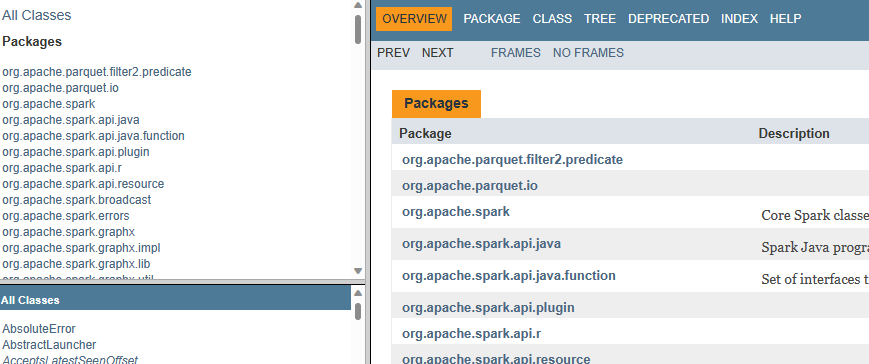


### Examples

2017 [trK54Ylmz/kafka-spark-streaming-example: Simple examle for Spark Streaming over Kafka topic](https://github.com/trK54Ylmz/kafka-spark-streaming-example) Github

>  A bit old sample for Spark streaming, but it has some good bash/command line examples

2020 [nitinware/spark-starter: spark starter java project](https://github.com/nitinware/spark-starter)

> Spark Java Maven Simple starter project


### Links

2023-03-13 [Add ALL the Things: Abstract Algebra Meets Analytics](https://www.infoq.com/presentations/abstract-algebra-analytics/)
>
> 2013-03-07 [AK Tech Blog](https://web.archive.org/web/20130307235411/http://blog.aggregateknowledge.com/)
> 2023-03-14 [GitHub - avibryant/simmer: Reduce your data. A unix filter for algebird-powered aggregation.](https://github.com/avibryant/simmer)
> 2023-03-14 [GitHub - twitter/algebird: Abstract Algebra for Scala](https://github.com/twitter/algebird)

2023-03-13 [Apache Spark Fundamentals | Pluralsight](https://app.pluralsight.com/course-player?clipId=da79701c-5b62-4649-a366-686c471f0934)

2023-02-12 [awesome-spark/awesome-spark: A curated list of awesome Apache Spark packages and resources.](https://github.com/awesome-spark/awesome-spark) 

> 

### Videos

2023-02-12 🎥 [Apache Spark Core—Deep Dive—Proper Optimization Daniel Tomes Databricks - YouTube](https://www.youtube.com/watch?v=daXEp4HmS-E) 

> 21:14:
> 
>
> - 2023-02-12 🎥 [Apache Spark Core – Practical Optimization Daniel Tomes Databricks - YouTube](https://www.youtube.com/watch?v=_ArCesElWp8)
> - See Slides at: [2023-02-12 Apache Spark Core—Deep Dive—Proper Optimization Daniel Tomes Databricks](https://blog.zharii.com/docs/resources/2023-02-12-Slides--Apache-Spark-Core-Deep-Dive-Proper-Optimization)

2023-02-12 [Spark SQL Shuffle Partitions - Spark By {Examples}](https://sparkbyexamples.com/spark/spark-shuffle-partitions/)

> 

```
spark.sql.shuffle.partitions
```


## Azure Synapse Analytics

## Overview

Azure Synapse is a big data analytics service provided by Microsoft that integrates big data and data warehousing into a single platform. It allows organizations to analyze large amounts of data from various sources including structured, semi-structured and unstructured data.

People use Azure Synapse for tasks such as data warehousing, data lake storage, big data analytics, and machine learning.

Main features of Azure Synapse include:

- Seamless integration of big data and data warehousing
- Serverless big data analytics through Spark
- Advanced security and data protection
- Hybrid data management and analytics
- Automated data ingestion and data preparation
- Advanced data visualization and exploration tools.


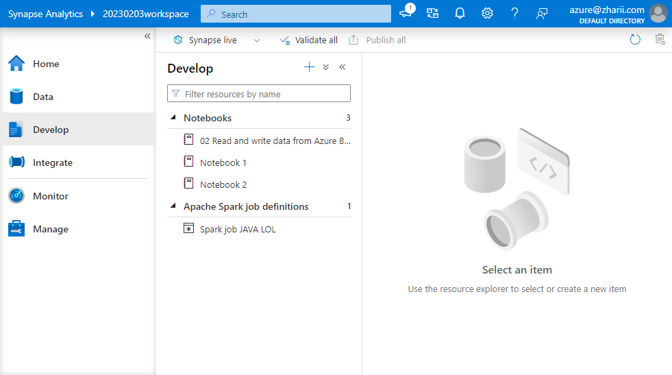


## Where the things are:

- **Home** -- No place like it!
- **Data** -- Manage / Create internal Hadoop / Spark tables
- **Develop** -- Upload Spark Jobs, create, import, export and run Notebooks (Python, C#, SQL, Scala)
- **Integrate** -- Create data ingestion / data processing pipelines with visual editor
- **Monitor** --  Spark Logs and Metrics
- **Manage** -- Create Spark Pools, manage resources, create linked resources (link external resources like Cosmos DB, SQL Server, Blob Containers etc.)


## Samples

2023-02-07 💖 [`Azure-Samples/Synapse: Samples for Azure Synapse Analytics`](https://github.com/Azure-Samples/Synapse) GitHub

> **MSFT**: This is a very comprehensive repository with tons of Notebooks and Spark Jobs samples. The best place to start.
> **Contents**
>
> - [CLI](https://github.com/Azure-Samples/Synapse/tree/master/CLI) - Azure CLI
> - [Data](https://github.com/Azure-Samples/Synapse/tree/master/Data) - Small sample data sets
> - [PowerShell](https://github.com/Azure-Samples/Synapse/tree/master/PowerShell) - Azure PowerShell scripts
> - [Notebooks](https://github.com/Azure-Samples/Synapse/tree/master/Notebooks) - Notebook files
> - [Spark](https://github.com/Azure-Samples/Synapse/tree/master/Spark) - Code for using Apache Spark
> - [SQL](https://github.com/Azure-Samples/Synapse/tree/master/SQL) - T-SQL scripts

2023-02-07 💖 [microsoft/SynapseML: Simple and Distributed Machine Learning](https://github.com/microsoft/SynapseML) Github

> **MSFT**: Synapse Machine Learning specific repository.
>
> 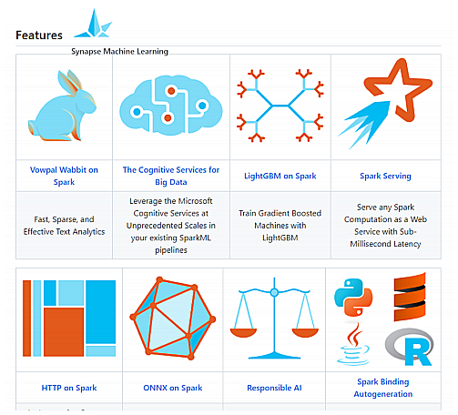

2023-02-07 **Azure Synapse Analytics Workshop** (level 400, 4 days) [solliancenet/azure-synapse-analytics-workshop-400](https://github.com/solliancenet/azure-synapse-analytics-workshop-400) Github, Slides

> External. Workshop Slides and materials
> 

2023-02-07 💖 **Azure Analytics End to End with Azure Synapse - Deployment Accelerator** [Azure/azure-synapse-analytics-end2end](https://github.com/Azure/azure-synapse-analytics-end2end) Github 

> Slides and diagrams and **Bicep / ARM Templates**  for an End to End Solution sample
>
> 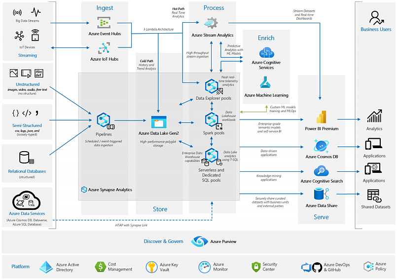

2023-02-07 [microsoft/AzureSynapseEndToEndDemo](https://github.com/microsoft/AzureSynapseEndToEndDemo) Github

> This repository provides one-click infrastructure and artifact deployment for Azure Synapse Analytics to get you started with Big Data Analytics on a large sized Health Care sample data. You will learn how to ingest, process and serve large volumes of data using various components of Synapse.

2023-04-09 [Azure Synapse Spark with Scala | DUSTIN VANNOY](https://dustinvannoy.com/2021/02/03/azure-synapse-spark-with-scala/)

> 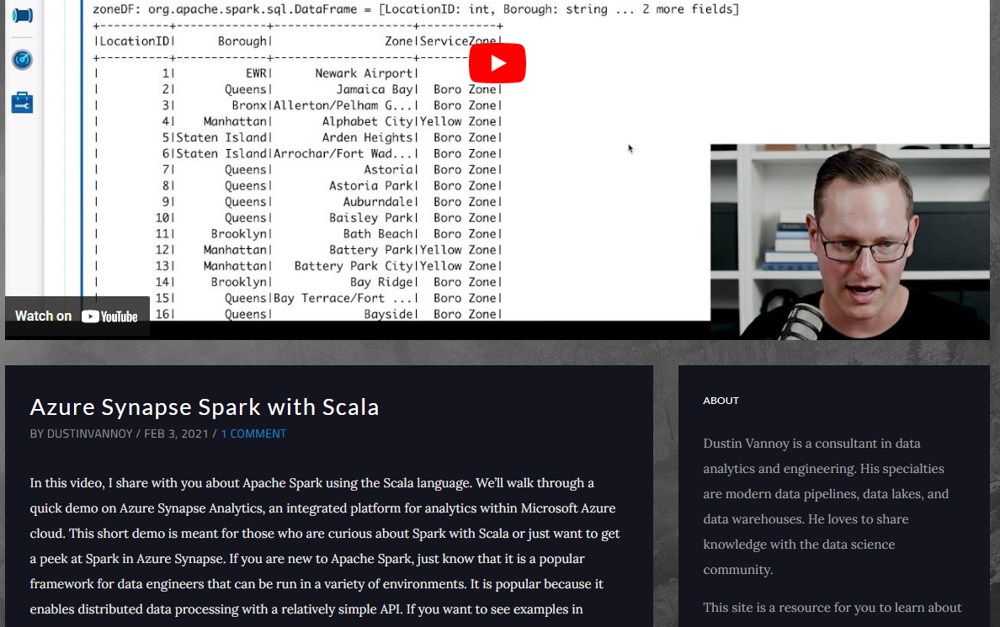


```scala
val inputDF = spark.read.parquet(yellowSourcePath)

// Take your pick on how to transform, withColumn or SQL Expressions. Only one of these is needed.

// Option A
// val transformedDF = {
//     inputDF
//      .withColumn("yearMonth", regexp_replace(substring("tpepPickupDatetime",1,7), '-', '_'))
//      .withColumn("pickupDt", to_date("tpepPickupDatetime", dateFormat)) 
//      .withColumn("dropoffDt", to_date("tpepDropoffDatetime", dateFormat))
//      .withColumn("tipPct", col("tipAmount") / col("totalAmount"))
// }

// Option B
val transformedDF = inputDF.selectExpr(
                  "*",
                  "replace(left(tpepPickupDatetime, 7),'-','_') as yearMonth",
                  s"to_date(tpepPickupDatetime, '$dateFormat') as pickupDt",
                  s"to_date(tpepDropoffDatetime, '$dateFormat') as dropoffDt",
                  "tipAmount/totalAmount as tipPct")

val zoneDF = spark.read.format("delta").load(taxiZonePath)

// Join to bring in Taxi Zone data
val tripDF = {
    transformedDF.as("t")
        .join(zoneDF.as("z"), expr("t.PULocationID == z.LocationID"), joinType="left").drop("LocationID")
        .withColumnRenamed("Burough", "PickupBurrough")
        .withColumnRenamed("Zone", "PickupZone")
        .withColumnRenamed("ServiceZone", "PickupServiceZone")
}

tripDF.write.mode("overwrite").partitionBy("yearMonth").format("delta").save(yellowDeltaPath)
```


## Azure Data Lake Storage Gen 2

2023-02-03 [Azure Data Lake Storage Gen 2 Overview - YouTube](https://www.youtube.com/watch?v=NHn5GAkvlwg) 

>  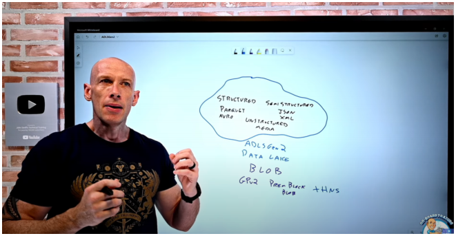

>  Gen2 is build on top of Storage Account with this option enabled (Enable hierarchical namespace):
>
>  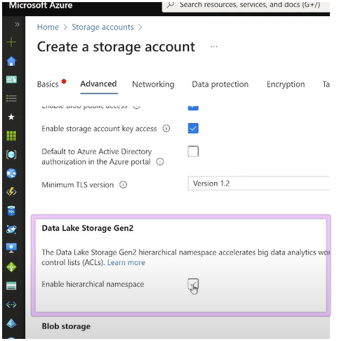
>
>  HNS enables real folder structure in blob storage containers. 


## Azure Data Lake URIs


- `wasbs://` is Windows Azure Storage Blob (WASB) + S (Secure) example: `wasbs://8f871c14-f903-42a8-9011-7d6fb48896af@cl3p8zpng3juv1ahtsv6cpl2.blob.core.windows.net/events/...` used as URI in Hadoop / Yarn / Spark
- `abfss://` stands for Azure Blob File System + S (Secure) and Microsoft recommends it for big data workloads as it is optimized for it. Sample: `abfss://myfstest@datalakestorealpha.dfs.core.windows.net/synapse/workspaces/20230203workspace/...`


# Scala and Spark

2023-02-26 🔥 [Scala Cheatsheet Scala Documentation](https://docs.scala-lang.org/cheatsheets/index.html)


2023-04-11 [#Scala Crash Course by a Scala Veteran (with some JavaScript flavor) - YouTube](https://www.youtube.com/watch?v=-xRfJcwhy7A)

2023-04-10 [Scala Tutorial - YouTube](https://www.youtube.com/watch?v=DzFt0YkZo8M)

> Derek Banas Cheatsheet:
> 2023-04-10 [Learn Scala in One Video](https://www.newthinktank.com/2015/08/learn-scala-one-video/) 

> Scala Syntax cheat sheet
```scala
// Shorthand notation (No randInt++, or randInt--)
randInt += 1
"randInt += 1" + randInt
```

2023-04-10 [Getting Started | Scala Documentation](https://docs.scala-lang.org/getting-started/index.html#using-the-scala-installer-recommended-way)

```cs
cs install scala:2.11.12 && cs install scalac:2.11.12
```

2023-04-03 [implicits Object — Implicits Conversions · The Internals of Spark SQL](https://jaceklaskowski.gitbooks.io/mastering-spark-sql/content/spark-sql-SparkSession-implicits.html)

> The Internals of Spark SQL (Apache Spark 2.4.5)
>
> Welcome to **The Internals of Spark SQL** online book!
>
> I’m [Jacek Laskowski](https://pl.linkedin.com/in/jaceklaskowski), a freelance IT consultant, software engineer and technical instructor specializing in [Apache Spark](https://spark.apache.org/), [Apache Kafka](https://kafka.apache.org/), [Delta Lake](https://delta.io/) and [Kafka Streams](https://kafka.apache.org/documentation/streams/) (with [Scala](https://www.scala-lang.org/) and [sbt](https://www.scala-sbt.org/)).

2023-04-03 [The Internals of Apache Spark](https://books.japila.pl/apache-spark-internals/)

> 

## Spark Notes

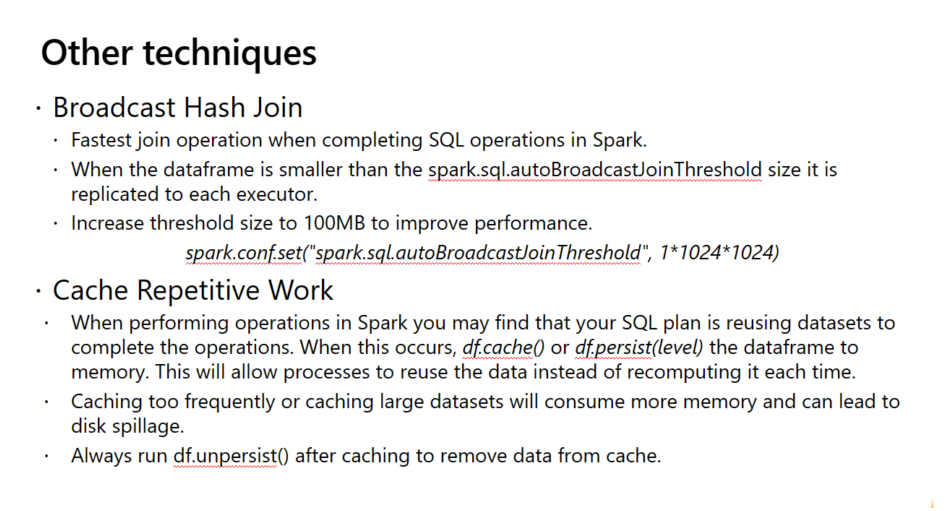

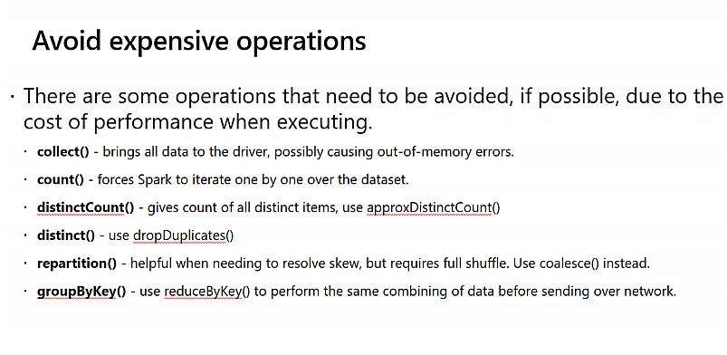

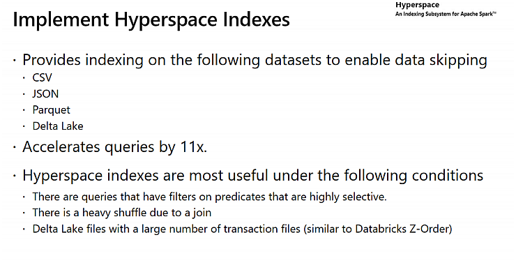

2023-02-12 [Spark SQL Shuffle Partitions - Spark By {Examples}](https://sparkbyexamples.com/spark/spark-shuffle-partitions/) 

> In this Apache Spark Tutorial, you will learn Spark with Scala code examples and every sample example explained here is available at [Spark Examples Github Project](https://github.com/spark-examples) for reference. All Spark examples provided in this Apache Spark Tutorial are basic, simple, and easy to practice for beginners who are enthusiastic to learn Spark, and these sample examples were tested in our development environment.

2023-02-12 [SQL Window Functions: Ranking](https://antonz.org/sql-window-functions-ranking/)

> *This is an excerpt from my book [SQL Window Functions Explained](https://antonz.org/sql-window-functions-book). The book is a clear and visual introduction to the topic with lots of practical exercises.*
>
> Ranking means coming up with all kinds of ratings, starting from the winners of the World Swimming Championships and ending with the Forbes 500.
>
> We will rank records from the toy `employees` table:
>
> ```
> ┌────┬───────┬────────┬────────────┬────────┐
> │ id │ name  │  city  │ department │ salary │
> ├────┼───────┼────────┼────────────┼────────┤
> │ 11 │ Diane │ London │ hr         │ 70     │
> │ 12 │ Bob   │ London │ hr         │ 78     │
> │ 21 │ Emma  │ London │ it         │ 84     │
> │ 22 │ Grace │ Berlin │ it         │ 90     │
> │ 23 │ Henry │ London │ it         │ 104    │
> │ 24 │ Irene │ Berlin │ it         │ 104    │
> │ 25 │ Frank │ Berlin │ it         │ 120    │
> │ 31 │ Cindy │ Berlin │ sales      │ 96     │
> │ 32 │ Dave  │ London │ sales      │ 96     │
> │ 33 │ Alice │ Berlin │ sales      │ 100    │
> └────┴───────┴────────┴────────────┴────────┘
> ```
>
> [playground](https://sqlime.org/#employees.db) • [download](https://antonz.org/sql-window-functions-book/employees.sql)
>
> Table of contents:
>
> - [Salary rating](https://antonz.org/sql-window-functions-ranking/#salary-rating)
> - [Window ordering vs. result ordering](https://antonz.org/sql-window-functions-ranking/#window-ordering-vs-result-ordering)
> - [Sorting uniqueness](https://antonz.org/sql-window-functions-ranking/#sorting-uniqueness)
> - [Salary rating by department](https://antonz.org/sql-window-functions-ranking/#salary-rating-by-department)
> - [Salary groups](https://antonz.org/sql-window-functions-ranking/#salary-groups)
> - [Ranking functions](https://antonz.org/sql-window-functions-ranking/#ranking-functions)
> - [Keep it up](https://antonz.org/sql-window-functions-ranking/#keep-it-up)

2023-02-12 [Apache Spark Core—Deep Dive—Proper Optimization Daniel Tomes Databricks - YouTube](https://www.youtube.com/watch?v=daXEp4HmS-E) 

> Optimizing spark jobs through a true understanding of spark core. Learn: What is a partition? What is the difference between read/shuffle/write partitions? How to increase parallelism and decrease output files? Where does shuffle data go between stages? What is the "right" size for your spark partitions and files? Why does a job slow down with only a few tasks left and never finish? Why doesn't adding nodes decrease my compute time?
>
> 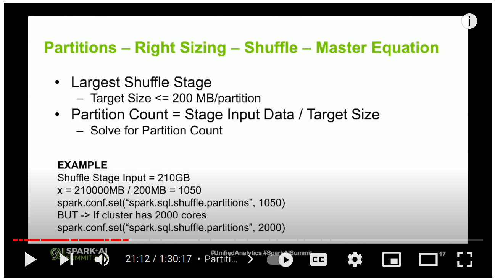

2023-02-11 [How to Train Really Large Models on Many GPUs? Lil'Log](https://lilianweng.github.io/posts/2021-09-25-train-large/) 

> In recent years, we are seeing better results on many NLP benchmark tasks with larger pre-trained [language models](https://lilianweng.github.io/posts/2019-01-31-lm/). How to train large and deep neural networks is challenging, as it demands a large amount of GPU memory and a long horizon of training time.
>
> However an individual GPU worker has limited memory and the sizes of many large models have grown beyond a single GPU. There are several parallelism paradigms to enable model training across multiple GPUs, as well as a variety of model architecture and memory saving designs to help make it possible to train *very large* neural networks.

2023-01-25 [Event Hubs ingestion performance and throughput Vincent-Philippe Lauzon’s](https://vincentlauzon.com/2018/06/05/event-hubs-ingestion-performance-and-throughput/)

>  Here are some recommendations in the light of the performance and throughput results:
>
>  - If we send **many events**: always reuse connections, i.e. do not create a connection only for one event. This is valid for both AMQP and HTTP. A simple [Connection Pool pattern](https://github.com/vplauzon/streaming/blob/master/ClientPerf/ClientConsole/EventHubClientPool.cs) makes this easy.
>  - If we send **many events** & **throughput** is a concern: use AMQP.
>  - If we send **few events** and **latency** is a concern: use HTTP / REST.
>  - If events naturally comes in **batch of many events**: use batch API.
>  - If events **do not** naturally comes in **batch of many events**: simply stream events. **Do not try** to batch them unless network IO is constrained.
>  - If a **latency** of **0.1 seconds** is a concern: move the call to Event Hubs away from your critical performance path.
>
>  Let’s now look at the tests we did to come up with those recommendations.

2023-02-16 [From ES6 to Scala: Basics - Scala.js](https://www.scala-js.org/doc/sjs-for-js/es6-to-scala-part1.html)

2023-02-15 [GitHub - alexandru/scala-best-practices: A collection of Scala best practices](https://github.com/alexandru/scala-best-practices)

2023-02-15 [lauris/awesome-scala: A community driven list of useful Scala libraries, frameworks and software.](https://github.com/lauris/awesome-scala)

2023-02-15 [Scalafix · Refactoring and linting tool for Scala](https://scalacenter.github.io/scalafix/)

2023-02-14 [zouzias/spark-hello-world: A simple hello world using Apache Spark](https://github.com/zouzias/spark-hello-world)

2023-02-14 [sbt Reference Manual — Installing sbt on Windows](https://www.scala-sbt.org/1.x/docs/Installing-sbt-on-Windows.html)

2023-02-14 [lolski/sbt-cheatsheet: Simple, no-nonsense guide to getting your Scala project up and running](https://github.com/lolski/sbt-cheatsheet)

2023-02-14 [marconilanna/scala-boilerplate: Starting point for Scala projects](https://github.com/marconilanna/scala-boilerplate)

2023-02-13 [Hyperspace indexes for Apache Spark - Azure Synapse Analytics Microsoft Learn](https://learn.microsoft.com/en-us/azure/synapse-analytics/spark/apache-spark-performance-hyperspace?pivots=programming-language-scala)

2023-02-13 [The Azure Spark Showdown - Databricks VS Synapse Analytics - Simon Whiteley - YouTube](https://www.youtube.com/watch?v=FjsnVueXijQ)

2023-02-06 [ossu/computer-science: Path to a free self-taught education in Computer Science!](https://github.com/ossu/computer-science)


## Parquet

2023-04-04 [Parquet: more than just "Turbo CSV"](https://csvbase.com/blog/3)


