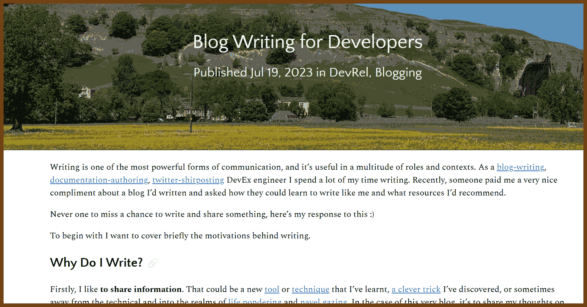
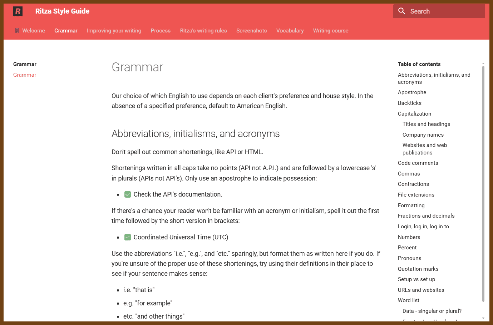
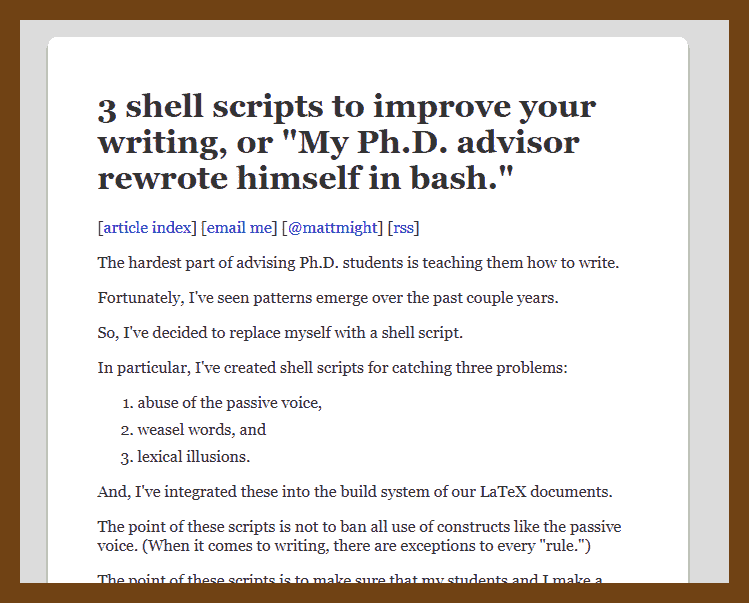
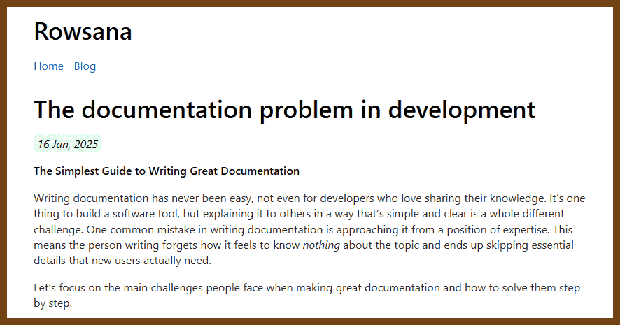

# ✏️ dev-writing
Date: 2024-11-10

2024-11-11 [Blog Writing for Developers](https://rmoff.net/2023/07/19/blog-writing-for-developers/) { rmoff.net }

> 

> Writing is one of the most powerful forms of communication, especially in technical fields like developer experience (DevEx) engineering. This article explores the motivations behind writing, practical strategies for creating developer-focused content, and actionable advice for maintaining clarity, personality, and consistency across different formats.
>
> Whether you're a DevEx engineer, tech blogger, or documentation author, these insights aim to help you improve your writing to share knowledge effectively, engage your audience, and build credibility within your field.

🔥🔥🔥2024-11-06 [LEADERSHIP LAB: The Craft of Writing Effectively - YouTube](https://www.youtube.com/watch?v=vtIzMaLkCaM) { www.youtube.com }🔥🔥🔥

> 

> found in 2024-11-06 [Blog Writing for Developers](https://rmoff.net/2023/07/19/blog-writing-for-developers/) { rmoff.net }

> **Introduction**
> Writing isn’t just about sharing information; it’s about making an impact. In this insightful lecture, a distinguished writing instructor from the University of Chicago's Writing Program emphasizes that effective writing requires understanding your audience, establishing relevance, and creating a compelling narrative. This article captures the speaker’s key advice on improving writing by focusing on purpose, value, and the reader's needs.
>
> ------
>
> 1. **Focus on Value, Not Originality**
>
> - **Advice**: The speaker challenges the idea that writing must always present something "new" or "original." Instead, writers should prioritize creating valuable content that resonates with their audience.
> - **Application**: Rather than striving for originality alone, focus on producing content that addresses the reader’s concerns or questions. A piece of writing is valuable if it enriches the reader’s understanding or helps solve a problem they care about.
>
> 2. **Define the Problem Clearly**
>
> - **Advice**: To make a piece of writing compelling, start by establishing a problem that is relevant to your audience. A well-defined problem creates a sense of instability or inconsistency, which engages readers and positions the writer as a problem-solver.
> - **Application**: Use contrasting language to highlight instability—words like "but," "however," and "although" signal unresolved issues. This approach shifts the reader’s focus to the problem at hand, making them more receptive to the writer's proposed solution.
>
> 3. **Understand and Address Your Reader’s Needs**
>
> - **Advice**: A writer’s task is to understand the specific needs and concerns of their reading community. This involves identifying problems that resonate with them and framing your thesis or solution in a way that is relevant to their lives or work.
> - **Application**: In academic and professional settings, locate problems in real-world contexts. Rather than presenting background information, articulate a challenge or inconsistency that is specific to the reader’s field or interests, making your argument compelling and directly relevant.
>
> 4. **Use the Language of Costs and Benefits**
>
> - **Advice**: Writers should make it clear how the identified problem affects the reader directly. Frame issues in terms of "costs" and "benefits" to emphasize why addressing the problem is essential.
> - **Application**: Highlight the impact of ignoring the problem versus the benefits of solving it. This approach reinforces the relevance of your writing by aligning it with the reader’s motivations and concerns.
>
> 5. **Beware of the "Gap" Approach**
>
> - **Advice**: Avoid using the concept of a "knowledge gap" as the sole justification for writing on a topic. While identifying gaps in research can work, it often lacks the urgency or impact required to engage readers fully.
> - **Application**: Rather than just pointing out missing information, emphasize the practical implications of filling that gap. Explain how the lack of certain knowledge creates instability or inconsistency in the field, making the need for your insights more compelling.
>
> 6. **Adopt a Community-Centric Perspective**
>
> - **Advice**: Tailor your writing to the specific communities who will read it. Different communities (e.g., narrative historians vs. sociologists) have distinct approaches to problems and value different types of arguments.
> - **Application**: Define and understand the community of readers your work is meant to serve. Address their concerns directly and frame your argument in terms that align with their unique perspectives and values.
>
> 7. **Learn from Published Articles**
>
> - **Advice**: Published work often contains subtle rhetorical cues about what resonates with readers in a specific field. Study these articles to understand the language, structure, and approach that successful writers use.
> - **Application**: Identify patterns in the language of published work within your target field. For instance, if a journal commonly uses cost-benefit language, incorporate it into your writing to align with reader expectations.
>
> 8. **Emphasize Function Over Form**
>
> - **Advice**: Writing should serve a clear function beyond just following formal rules. Effective writing achieves its purpose by clearly communicating the problem and its significance to readers.
> - **Application**: Instead of focusing solely on rules or formalities, think about what your writing needs to accomplish for your audience. Make sure that every section and statement reinforces your overall argument and purpose.

2024-11-11 [technical-writing/resources.md at master · sixhobbits/technical-writing](https://github.com/sixhobbits/technical-writing/blob/master/resources.md) { github.com }

> There are a number of resources relating to technical writing, scattered around the web and in print. This is a (growing) list of technical writing resources. Pull requests to add titles are encouraged. Please add the title and a brief summary following the style below. For articles that are available on the web, provide a link.
>
> 

2024-11-11 [Grammar - Ritza Style Guide](https://styleguide.ritza.co/grammar/grammar/) { styleguide.ritza.co }

> 

2024-12-15 [3 shell scripts: Kill weasel words, avoid the passive, eliminate duplicates](https://matt.might.net/articles/shell-scripts-for-passive-voice-weasel-words-duplicates/) { matt.might.net }

> 

> **3 shell scripts to improve your writing, or "My Ph.D. advisor rewrote himself in bash."**
>
> The hardest part of advising Ph.D. students is teaching them how to write.
>
> Fortunately, I've seen patterns emerge over the past couple years.
>
> So, I've decided to replace myself with a shell script.
>
> In particular, I've created shell scripts for catching three problems:
>
> 1. abuse of the passive voice,
> 2. weasel words, and
> 3. lexical illusions.
>
> 
>
> And, I've integrated these into the build system of our LaTeX documents.
>
> The point of these scripts is not to ban all use of constructs like the passive voice. (When it comes to writing, there are exceptions to every "rule.")
>
> The point of these scripts is to make sure that my students and I make a *conscious* choice to use these constructs.
>
> When these scripts highlight a sentence, my students should ask themselves, "Is there a better way to say what I said--a way to make the text read with more clarity and precision?" Often enough, the answer is "yes."
>
> The meta-point of this article is that writers should learn their individual weaknesses. And, when writers are programmers, we should enlist automation to combat these weaknesses.1
>
> ## More resources
>
> There are four books at arm's length in my office:
>
> - Strunk and White's [The Elements of Style](http://www.amazon.com/gp/product/0205632645?ie=UTF8&tag=mmamzn06-20&linkCode=as2&camp=1789&creative=390957&creativeASIN=0205632645) is still a good, if not perfect, reference on style. Young writers should calibrate their reading of *Elements* in light of [criticism](http://chronicle.com/article/50-Years-of-Stupid-Grammar/25497) from linguistic experts. Experts claim that the good parts of Strunk and White are common sense. I take issue only with their application of the modifier *common*. My counterparts in linguistics and the humanities must have never seen the aggressive absence of style that permeates writing in science, engineering and mathematics.
> - After reading this post, my colleague [Zachary Tatlock](http://cseweb.ucsd.edu/~ztatlock/) recommended [Style: The Basics of Clarity and Grace](http://www.amazon.com/gp/product/0205605354?ie=UTF8&tag=mmamzn06-20&linkCode=as2&camp=1789&creative=390957&creativeASIN=0205605354) as a better reference than Strunk and White. Having had a chance to read it, I agree with Zachary. If you can get only one book, this is the one to get. (I'd still recommend a thoughtful reading of both.)
> - When I have a dispute, [The Chicago Manual of Style](http://www.amazon.com/gp/product/0226104206?ie=UTF8&tag=mmamzn06-20&linkCode=as2&camp=1789&creative=390957&creativeASIN=0226104206) ends it.
> - [A Manual for Writers of Research Papers, Theses, and Dissertations](http://www.amazon.com/gp/product/0226823377?ie=UTF8&tag=mmamzn06-20&linkCode=as2&camp=1789&creative=390957&creativeASIN=0226823377) is the Chicago manual for technical writing.
>
> ## Precision and clarity
>
> My Ph.D. advisor, [Olin Shivers](http://www.ccs.neu.edu/home/shivers/), taught me that technical writing is a balancing act between precision, clarity and marketing.
>
> After a recent round of paper submissions with my own Ph.D. students, I've identified mechanically recognizable ways that precision and clarity leak out of a paper: weasel words and abuse of the passive voice.
>
> So, I've written shell scripts to detect these leaks.
>
> (I don't think I'll ever be able to write a shell script that detects bad marketing for a scientific idea.)
>
> ## Weasel words
>
> Weasel words--phrases or words that sound good without conveying information--obscure precision.
>
> I notice three kinds of weasel words in my students' writing: (1) salt and pepper words, (2) beholder words and (3) lazy words.
>
> ### Salt and pepper words
>
> New grad students sprinkle in salt and pepper words for seasoning. These words look and feel like technical words, but convey nothing.
>
> My favorite salt and pepper words/phrases are *various*, *a number of*, *fairly*, and *quite*. Sentences that cut these words out become stronger.
>
> ```
>  Bad:    It is quite difficult to find untainted samples.
>  Better: It is difficult to find untainted samples.
>  Bad:    We used various methods to isolate four samples.
>  Better: We isolated four samples.
> ```
>
> ### Beholder words
>
> Beholder words are those whose meaning is a function of the reader; for example: *interestingly*, *surprisingly*, *remarkably*, or *clearly*.
>
> Peer reviewers don't like judgments drawn for them.
>
> ```
> Bad:    False positives were surprisingly low.
> Better: To our surprise, false positives were low.
> Good:   To our surprise, false positives were low (3%).
> ```
>
> ### Lazy words
>
> Students insert lazy words in order to avoid making a quantitative characterization. They give the impression that the author has not yet conducted said characterization.
>
> These words make the science feel unfirm and unfinished.
>
> The two worst offenders in this category are the words *very* and *extremely*. These two adverbs are never excusable in technical writing. Never.
>
> Other offenders include *several*, *exceedingly*, *many*, *most*, *few*, *vast*.
>
> ```
>  Bad:    There is very close match between the two semantics.
>  Better: There is a close match between the two semantics.
> ```
>
> ### Adverbs
>
> In technical writing, adverbs tend to come off as weasel words.
>
> I'd even go so far as to say that the removal of all adverbs from any technical writing would be a net positive for my newest graduate students. (That is, new graduate students weaken a sentence when they insert adverbs more frequently than they strengthen it.)
>
> ```
>  Bad:    We offer a completely different formulation of CFA.
>  Better: We offer a different formulation of CFA.
> ```
>
> ### A script to find weasel words
>
> With this script, you can supply an alternate list of weasel words in a file if you don't like the default:
>
> ```sh
> #!/bin/bash
> 
> weasels="many|various|very|fairly|several|extremely\
> |exceedingly|quite|remarkably|few|surprisingly\
> |mostly|largely|huge|tiny|((are|is) a number)\
> |excellent|interestingly|significantly\
> |substantially|clearly|vast|relatively|completely"
> 
> wordfile=""
> 
> # Check for an alternate weasel file
> if [ -f $HOME/etc/words/weasels ]; then
>     wordfile="$HOME/etc/words/weasels"
> fi
> 
> if [ -f $WORDSDIR/weasels ]; then
>     wordfile="$WORDSDIR/weasels"
> fi
> 
> if [ -f words/weasels ]; then
>     wordfile="words/weasels"
> fi
> 
> if [ ! "$wordfile" = "" ]; then
>     weasels="xyzabc123";
>     for w in `cat $wordfile`; do
>         weasels="$weasels|$w"
>     done
> fi
> 
> 
> if [ "$1" = "" ]; then
>  echo "usage: `basename $0` <file> ..."
>  exit
> fi
> 
> egrep -i -n --color "\\b($weasels)\\b" $*
> 
> exit $?
> ```
>
> ## Passive voice
>
> There are times when the passive voice is acceptable in technical writing.
>
> I also believe, as with adverbs, that removal of the passive voice would have been a net improvement for over half the technical writing I've edited. (That is, students abuse the passive voice more often than they use it well.)
>
> Of course, I do not advocate dogmatic removal of the passive voice.
>
> The passive voice is tough to shake. Even while writing this article, I caught myself defaulting to the passive in situations where the active was better.
>
> The passive voice is bad when it hides relevant or explanatory information:
>
> ```
>  Bad:    Termination is guaranteed on any input.
>  Better: Termination is guaranteed on any input by a finite state-space.
>  OK:     A finite state-space guarantees termination on any input.
> ```
>
> In the first sentence, the passive hides relevant information.
>
> The second sentence includes the relevant information, but the passive misplaces the emphasis.
>
> The third sentence contains all the relevant information, and it feels crisp.
>
> There's one case where I think the passive is preferrable in technical writing--when the subject is truly irrelevant:
>
> ```
>  OK: 4 mL HCl were added to the solution.
> ```
>
> Even in this example, I personally don't believe it's egregious to use *we*:
>
> ```
>  OK (to me): We added 4 mL HCl to the solution.
> ```
>
> In summary, for each use of the passive highlighted by my script, ask the following questions:
>
> 1. Is the agent relevant yet unclear?
> 2. Does the text read better with the sentence in the active?
>
> If the answer to both questions is "yes," then change to the active.
>
> If only the answer to the first question is "yes," then specify the agent.
>
> ### A script to find passive voice
>
> ```sh
> #!/bin/bash
> 
> irregulars="awoken|\
> been|born|beat|\
> become|begun|bent|\
> beset|bet|bid|\
> bidden|bound|bitten|\
> bled|blown|broken|\
> bred|brought|broadcast|\
> built|burnt|burst|\
> bought|cast|caught|\
> chosen|clung|come|\
> cost|crept|cut|\
> dealt|dug|dived|\
> done|drawn|dreamt|\
> driven|drunk|eaten|fallen|\
> fed|felt|fought|found|\
> fit|fled|flung|flown|\
> forbidden|forgotten|\
> foregone|forgiven|\
> forsaken|frozen|\
> gotten|given|gone|\
> ground|grown|hung|\
> heard|hidden|hit|\
> held|hurt|kept|knelt|\
> knit|known|laid|led|\
> leapt|learnt|left|\
> lent|let|lain|lighted|\
> lost|made|meant|met|\
> misspelt|mistaken|mown|\
> overcome|overdone|overtaken|\
> overthrown|paid|pled|proven|\
> put|quit|read|rid|ridden|\
> rung|risen|run|sawn|said|\
> seen|sought|sold|sent|\
> set|sewn|shaken|shaven|\
> shorn|shed|shone|shod|\
> shot|shown|shrunk|shut|\
> sung|sunk|sat|slept|\
> slain|slid|slung|slit|\
> smitten|sown|spoken|sped|\
> spent|spilt|spun|spit|\
> split|spread|sprung|stood|\
> stolen|stuck|stung|stunk|\
> stridden|struck|strung|\
> striven|sworn|swept|\
> swollen|swum|swung|taken|\
> taught|torn|told|thought|\
> thrived|thrown|thrust|\
> trodden|understood|upheld|\
> upset|woken|worn|woven|\
> wed|wept|wound|won|\
> withheld|withstood|wrung|\
> written"
> 
> if [ "$1" = "" ]; then
>  echo "usage: `basename $0` <file> ..."
>  exit
> fi
> 
> egrep -n -i --color \
>  "\\b(am|are|were|being|is|been|was|be)\
> \\b[ ]*(\w+ed|($irregulars))\\b" $*
> 
> exit $?
> ```
>
> ## A script to find lexical illusions
>
> Read the following text:
>
> ```sh
>  Many readers are not aware that the
>  the brain will automatically ignore
>  a second instance of the word "the"
>  when it starts a new line. 
> ```
>
> Read that same text again, but with different line breaks:
>
> ```sh
>  Many readers are not aware that the the
>  brain will automatically ignore a second
>  instance of the word "the" when it starts
>  a new line. 
> ```
>
> Duplicating words is a phenomenon of electronic composition.
>
> They seem to happen as cut and paste accidents, and most frequently it's with the word *the*.
>
> Unfortunately, it can be difficult to proofread away duplicate words, because this lexical illusion prevents us from finding them.
>
> No reviewer will shoot down a submission solely because it contains duplicate words, but when small mistakes like spelling errors and duplicate words pile up, they convey a lack of proofreading.
>
> Reviewers will (rightfully) interpret inadequate proofreading as a lack of respect for their time and attention.
>
> Fortunately, a short perl script hunts these bugs down:
>
> ```sh
> #!/usr/bin/env perl
> 
> # Finds duplicate adjacent words.
> 
> use strict ;
> 
> my $DupCount = 0 ;
> 
> if (!@ARGV) {
>   print "usage: dups <file> ...\n" ;
>   exit ;
> }
> 
> while (1) {
>   my $FileName = shift @ARGV ;
> 
>   # Exit code = number of duplicates found.  
>   exit $DupCount if (!$FileName) ;
> 
>   open FILE, $FileName or die $!; 
>   
>   my $LastWord = "" ;
>   my $LineNum = 0 ;
>   
>   while (<FILE>) {
>     chomp ;
> 
>     $LineNum ++ ;
>     
>     my @words = split (/(\W+)/) ;
>     
>     foreach my $word (@words) {
>       # Skip spaces:
>       next if $word =~ /^\s*$/ ;
> 
>       # Skip punctuation:
>       if ($word =~ /^\W+$/) {
>         $LastWord = "" ;
>         next ;
>       }
>       
>       # Found a dup? 
>       if (lc($word) eq lc($LastWord)) {
>         print "$FileName:$LineNum $word\n" ;
>         $DupCount ++ ;
>       } # Thanks to Sean Cronin for tip on case.
> 
>       # Mark this as the last word:
>       $LastWord = $word ;
>     }
>   }
>   
>   close FILE ;
> }
> ```
>
> ## Makefile integration
>
> I keep a local copy of the scripts in the `bin/` directory of each paper's repository. Then, I add a `make proof` rule to Makefile:
>
> ```sh
> # Check style:
> proof:
>         echo "weasel words: "
>         sh bin/weasel *.tex
>         echo
>         echo "passive voice: "
>         sh bin/passive *.tex
>         echo
>         echo "duplicates: "
>         perl bin/dups *.tex
> ```
>
> ## A few words on marketing
>
> A grad student's first impulse when she starts grad school is to assume that, as long as she tells the whole truth and nothing but the truth, everything she writes has to be accepted for publication.
>
> But, there are a lot of true things.
>
> Given the volume of submissions to top peer-reviewed venues, there will always be more than enough technically correct papers to fill the venue.
>
> The function of peer review has become to decide which true things are worth knowing.
>
> In that sense, peer reviewers are the guardians of the scientific community's most limited resource: our collective attention span.
>
> To market a paper, the author must make a compelling case for why her idea deserves access to that resource.
>
> ## Resources
>
> - Benjamin Beckwith has contributed a ["writegood"](http://github.com/bnbeckwith/writegood-mode) mode for emacs inspired by these scripts.
>
> ------
>
> [1] For example, my colleague [John Regehr,](http://blog.regehr.org/) suggested simple scripts to catch students' use of superfluous phrases like, "Note that," and "Notice that." Others have suggested scripts for using the future tense in technical writing.

2025-01-18 [The documentation problem in development | Rowsana](https://rowsana.bearblog.dev/the-documentation-problem/) { rowsana.bearblog.dev }

> 
>
> Here’s an improved version with more natural flow, clear separation of ideas, and better emphasis:
>
> ------
>
> Writing great documentation is about clarity and usability. **Good documentation is essential** because it saves time, reduces confusion, and helps teams stay aligned. For users, it simplifies learning and makes tools accessible, preventing frustration and unnecessary support tickets.
>
> The most common challenges in documentation stem from three key issues. First, a **lack of a clear learning path**, where users are thrown into advanced topics without building a solid foundation. Second, **assuming prior knowledge**, which skips essential explanations and leaves beginners struggling. Third, **insufficient examples**, where concepts remain abstract because users can’t see how they apply in real-life scenarios.
>
> To overcome these issues, focus on **clarity and structure**. Use the MECE principle to organize content: make sections **mutually exclusive** to avoid repetition and **collectively exhaustive** to cover every use case, endpoint, and edge case. Be thorough in your details. Document every endpoint with clear explanations of what it does, its parameters, and its responses. Include **error details**, such as `401 Unauthorized` or `404 Not Found`, with clear causes and fixes. Add **real-life examples** of requests and responses to show how everything works in practice.
>
> **Readability and formatting** are crucial. Write in clear, simple language, avoiding unnecessary jargon. Break content into short, focused paragraphs and use whitespace to make it less intimidating. Stick to one consistent font and limit color use to highlight critical information without distractions. Visual aids like tables, flowcharts, and annotated examples can make complex ideas easier to understand. Consistency is key: use the same terminology throughout and stick to an active voice for clarity. If your tool includes technical or domain-specific terms, include a glossary for easy reference.
>
> Documentation must evolve alongside the software. Use **version control** to track changes and ensure no detail is overlooked. Regularly review and update the content to keep it accurate. Gather feedback from users and testers to spot unclear areas or mistakes. Keep users informed of changes through **changelogs** and notifications, and provide **transition guides** for major updates or breaking changes to make adaptation seamless.
>
> **Good documentation may seem simple, but it takes careful effort to create.** By addressing common issues, starting from the basics, and presenting content clearly and consistently, you’ll build a resource that works for users of all experience levels. This investment builds trust, reduces support needs, and ensures your work can be understood and adopted effectively.
