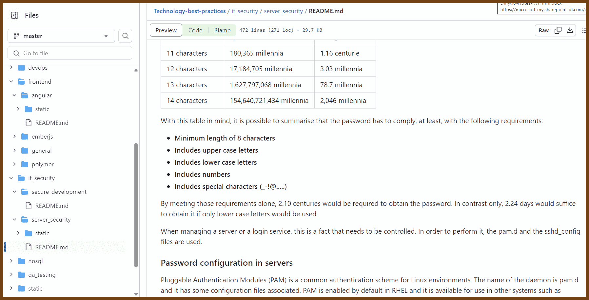

## Security engineering articles
- 2022-04-23 [How SHA-256 Works Step-By-Step Boot.dev](https://blog.boot.dev/cryptography/how-sha-2-works-step-by-step-sha-256/)
- 2022-04-23 [Very Basic Intro to Hash Functions SHA-256, MD5, etc Boot.dev](https://blog.boot.dev/cryptography/very-basic-intro-to-hash-functions-sha-256-md-5-etc/)
- 2022-04-23 [Basic Intro to Key Derivation Functions Boot.dev](https://blog.boot.dev/cryptography/key-derivation-functions/)
> By Lane Wagner on Dec 30, 2019
- 2022-04-20 [What an X.509 Certificate Is & How It Works Sectigo® Official](https://sectigo.com/resource-library/what-is-x509-certificate)
- 2022-04-20 [What is an X.509 certificate?](https://www.techtarget.com/searchsecurity/definition/X509-certificate)
- 2022-06-01 📺 [7 Cryptography Concepts EVERY Developer Should Know - YouTube](https://www.youtube.com/watch?v=NuyzuNBFWxQ)


## Books and Courses
- 2022-01-19 🎥 [Security engineering course   Light Blue Touchpaper](https://www.lightbluetouchpaper.org/2022/01/19/security-engineering-course/)
- 2022-01-19 📕 [Security Engineering - A Guide to Building Dependable Distributed Systems](https://www.cl.cam.ac.uk/~rja14/book.html)
- Lectures: 🤩  CS50 Cybersecurity

  > This is CS50, Harvard University's introduction to the intellectual enterprises of computer science and the art of programming.
  >

  - 2024-12-26 [CS50 Cybersecurity - Lecture 1 - Securing Data - YouTube](https://www.youtube.com/watch?v=X3DVaMnl5n8) { www.youtube.com } { by David Malan}

    > 
    > TABLE OF CONTENTS
    >
    > 00:00:00 - Introduction
    > 00:00:17 - Securing Data
    > 00:02:21 - Hashing
    > 00:39:52 - Secret-Key Cryptography
    > 01:03:21 - Public-Key Cryptography
    > 01:16:14 - Digital Signatures
    > 01:27:57 - Passkeys
    > 01:34:47 - Encryption in Transit
    > 01:40:10 - Deletion
    > 01:46:28 - Encryption at Rest
    > 01:50:59 - Ransomware
    > 01:52:24 - Quantum Computing

  - 2024-12-26 [CS50 Cybersecurity - Lecture 2 - Securing Systems - YouTube](https://www.youtube.com/watch?v=9phdZjF8qOk) { www.youtube.com }

    > TABLE OF CONTENTS
    >
    > 00:00:00 - Introduction
    > 00:00:17 - Wi-Fi
    > 00:02:50 - HTTP
    > 00:08:50 - Packet Sniffing
    > 00:13:45 - Cookies
    > 00:18:32 - HTTPS
    > 00:37:56 - VPNs
    > 00:41:11 - SSH
    > 00:43:48 - Ports
    > 00:51:33 - IP Addresses
    > 00:53:33 - Deep Packet Inspection
    > 00:54:50 - Proxy
    > 01:03:49 - Malware
    > 01:12:43 - Antivirus
    > 01:15:19 - Zero-Day Attacks

  - 2024-12-26 [CS50 Cybersecurity - Lecture 3 - Securing Software - YouTube](https://www.youtube.com/watch?v=5rsKrTh3fAo) { www.youtube.com }

    > TABLE OF CONTENTS
    >
    > 00:00:00 - Introduction
    > 00:00:17 - Phishing
    > 00:11:48 - Code Injection
    > 00:26:54 - Stored Attacks
    > 00:39:26 - SQL Injection
    > 00:54:49 - Prepared Statements
    > 00:59:57 - Command Injection
    > 01:07:51 - Client-Side Validation
    > 01:10:31 - Server-Side Validation
    > 01:12:44 - Cross-Site Request Forgery
    > 01:28:39 - Open Worldwide Application Security Project
    > 01:29:11 - Arbitrary Code Execution
    > 01:40:28 - Reverse Engineering
    > 01:42:03 - Open-Source and Closed-Source Software
    > 01:45:15 - App Stores
    > 01:50:40 - Package Managers
    > 01:51:25 - Operating Systems
    > 01:53:03 - Vulnerability Catalogs


## Articles

- 2024-02-09 [Technology-best-practices/it_security/server_security/README.md at master · vaquarkhan/Technology-best-practices · GitHub](https://github.com/vaquarkhan/Technology-best-practices/blob/master/it_security/server_security/README.md)

> 


- 2022-03-05 [Badly implementing encryption](https://ayende.com/blog/posts/series/196449-A/badly-implementing-encryption)
> Low-level security in Rust
- 2022-02-22 ⭐⭐⭐ [veeral-patel/how-to-secure-anything: How to systematically secure anything: a repository about security engineering](https://github.com/veeral-patel/how-to-secure-anything)
> Security engineering is the discipline of building secure systems.
> Its lessons are not just applicable to computer security. In fact, in this repo, I aim to document a process for securing anything, whether it's a medieval castle, an art museum, or a computer network.

2023-06-12 [Desktop Linux Hardening | PrivSec - A practical approach to Privacy and Security](https://privsec.dev/posts/linux/desktop-linux-hardening/)

> 
>
> ToC
>
> - During Installation
>   - [Drive Encryption](https://privsec.dev/posts/linux/desktop-linux-hardening/#drive-encryption)
>   - [Encrypted Swap](https://privsec.dev/posts/linux/desktop-linux-hardening/#encrypted-swap)
> - Privacy Tweaks
>   - [NetworkManager Trackability Reduction](https://privsec.dev/posts/linux/desktop-linux-hardening/#networkmanager-trackability-reduction)
>   - Other Identifiers
>     - [System Counting](https://privsec.dev/posts/linux/desktop-linux-hardening/#system-counting)
>   - [Keystroke Anonymization](https://privsec.dev/posts/linux/desktop-linux-hardening/#keystroke-anonymization)
> - Application Confinement
>   - [Flatpak](https://privsec.dev/posts/linux/desktop-linux-hardening/#flatpak)
>   - [Snap](https://privsec.dev/posts/linux/desktop-linux-hardening/#snap)
>   - [Firejail](https://privsec.dev/posts/linux/desktop-linux-hardening/#firejail)
>   - [Mandatory Access Control](https://privsec.dev/posts/linux/desktop-linux-hardening/#mandatory-access-control)
>   - [Making Your Own Policies/Profiles](https://privsec.dev/posts/linux/desktop-linux-hardening/#making-your-own-policiesprofiles)
>   - [Securing Linux Containers](https://privsec.dev/posts/linux/desktop-linux-hardening/#securing-linux-containers)
> - Security Hardening
>   - [Umask 077](https://privsec.dev/posts/linux/desktop-linux-hardening/#umask-077)
>   - [Microcode Updates](https://privsec.dev/posts/linux/desktop-linux-hardening/#microcode-updates)
>   - [Firmware Updates](https://privsec.dev/posts/linux/desktop-linux-hardening/#firmware-updates)
>   - [Firewall](https://privsec.dev/posts/linux/desktop-linux-hardening/#firewall)
>   - Kernel Hardening
>     - [Runtime Kernel Parameters (sysctl)](https://privsec.dev/posts/linux/desktop-linux-hardening/#runtime-kernel-parameters-sysctl)
>     - Boot Parameters
>       - [CPU mitigations](https://privsec.dev/posts/linux/desktop-linux-hardening/#cpu-mitigations)
>       - [Kernel](https://privsec.dev/posts/linux/desktop-linux-hardening/#kernel)
>       - [Entropy generation](https://privsec.dev/posts/linux/desktop-linux-hardening/#entropy-generation)
>       - [DMA mitigations](https://privsec.dev/posts/linux/desktop-linux-hardening/#dma-mitigations)
>     - [Kernel Modules](https://privsec.dev/posts/linux/desktop-linux-hardening/#kernel-modules)
>     - [Restricting access to /proc and /sys](https://privsec.dev/posts/linux/desktop-linux-hardening/#restricting-access-to-proc-and-sys)
>     - [linux-hardened](https://privsec.dev/posts/linux/desktop-linux-hardening/#linux-hardened)
>     - [grsecurity](https://privsec.dev/posts/linux/desktop-linux-hardening/#grsecurity)
>   - [Hardened Memory Allocator](https://privsec.dev/posts/linux/desktop-linux-hardening/#hardened-memory-allocator)
>   - [Mountpoint Hardening](https://privsec.dev/posts/linux/desktop-linux-hardening/#mountpoint-hardening)
>   - [Disabling SUID](https://privsec.dev/posts/linux/desktop-linux-hardening/#disabling-suid)
>   - [DNSSEC](https://privsec.dev/posts/linux/desktop-linux-hardening/#dnssec)
>   - [Time Synchronization](https://privsec.dev/posts/linux/desktop-linux-hardening/#time-synchronization)
>   - [Pluggable Authentication Modules (PAM)](https://privsec.dev/posts/linux/desktop-linux-hardening/#pluggable-authentication-modules-pam)
>   - Storage Media Handling
>     - [UDisks](https://privsec.dev/posts/linux/desktop-linux-hardening/#udisks)
>     - [autofs](https://privsec.dev/posts/linux/desktop-linux-hardening/#autofs)
>   - [USB Port Protection](https://privsec.dev/posts/linux/desktop-linux-hardening/#usb-port-protection)
> - Secure Boot
>   - [Enrolling your own keys](https://privsec.dev/posts/linux/desktop-linux-hardening/#enrolling-your-own-keys)
>   - [Unified Kernel Image](https://privsec.dev/posts/linux/desktop-linux-hardening/#unified-kernel-image)
>   - Encrypted /boot
>     - [openSUSE](https://privsec.dev/posts/linux/desktop-linux-hardening/#opensuse)
>     - [Other Distributions](https://privsec.dev/posts/linux/desktop-linux-hardening/#other-distributions)
>   - [Notes on Secure Boot](https://privsec.dev/posts/linux/desktop-linux-hardening/#notes-on-secure-boot)

## NGINX
- 2022-02-22 [Avoiding the Top 10 NGINX Configuration Mistakes - NGINX](https://www.nginx.com/blog/avoiding-top-10-nginx-configuration-mistakes/)

## TLS

- 2022-08-03 [The Illustrated TLS 1.3 Connection: Every Byte Explained](https://tls13.xargs.org/)
> Every byte explained and reproduced
> In this demonstration a client connects to a server, negotiates a TLS 1.3 session, sends "ping", receives "pong", and then terminates the session. Click below to begin exploring.

## Notes
- 2022-11-28 [Downloading the official binaries — Tabletop Club master documentation](https://tabletop-club.readthedocs.io/en/latest/general/download/downloading_binaries.html)

```sh
# Windows
certutil -hashfile TabletopClub_vX.X.X_Windows_64.zip SHA512

# macOS
shasum -a 512 TabletopClub_vX.X.X_OSX_Universal.zip

# Linux / *BSD
sha512sum TabletopClub_vX.X.X_Linux_64.zip
```
## Tools

### OpenSSL

- 2022-06-14 [How to encrypt a big file using OpenSSL and someone's public key](https://www.czeskis.com/random/openssl-encrypt-file.html)
- 2022-06-14 [Encrypting and decrypting files with OpenSSL Opensource.com](https://opensource.com/article/21/4/encryption-decryption-openssl)
> Stay on top of the latest thoughts, strategies and insights from enterprising peers.

### Messengers
- 2022-06-14 [Off-the-Record Messaging](https://otr.cypherpunks.ca/)

